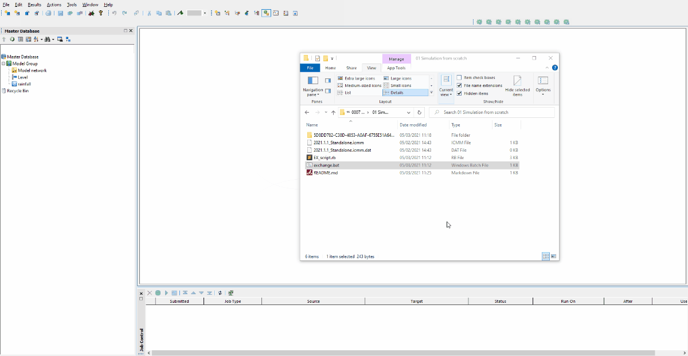

# Run a simulation from scratch
This [script](EX_script.rb) creates a new run object from database objects and runs a simulation. Example [database](database.zip) and trigger [bat file](exchange.bat) attached.

The script includes code for four modes of running simulations.
Mode 1 - Using `launch_sims` with a command line progress status update which makes use of the `status` method
Mode 2 - Using `launch_sims` and waiting for all simulations to end using the `wait_for_jobs` method
Mode 3 - Using `sim_ex` using two parameters (a string and an integer)
Mode 4 - Using `sim_ex` using one parameter (a hash)

See [documentation](DOCUMENTATION.md) for more detailed information (props to the Innovyze Development team 🙏).

