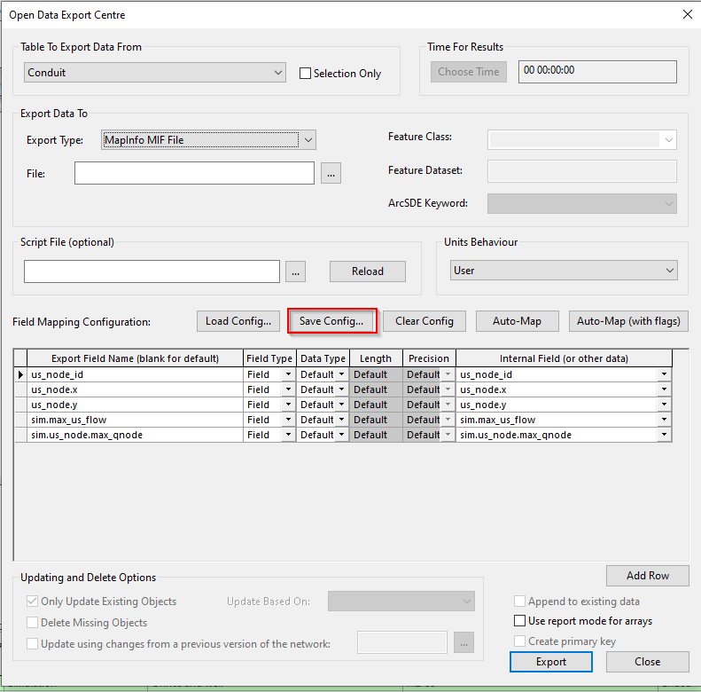

# Export Node and Conduit tables to CSV and MIF using ODEC
The script in this example exports tables `Node` and `Conduit` to a `E:\Temp` folder using the Open Data Export Centre. It requires the `ICMFieldMapping.cfg` file to be in the same folder. This file maps the ICM table fields to the exported formats. It exports the tables to the `CSV` and `MIF` formats and returns a completion message.

You can export a user defined configuration file from the ICM ODEC, under `Save Config`:
