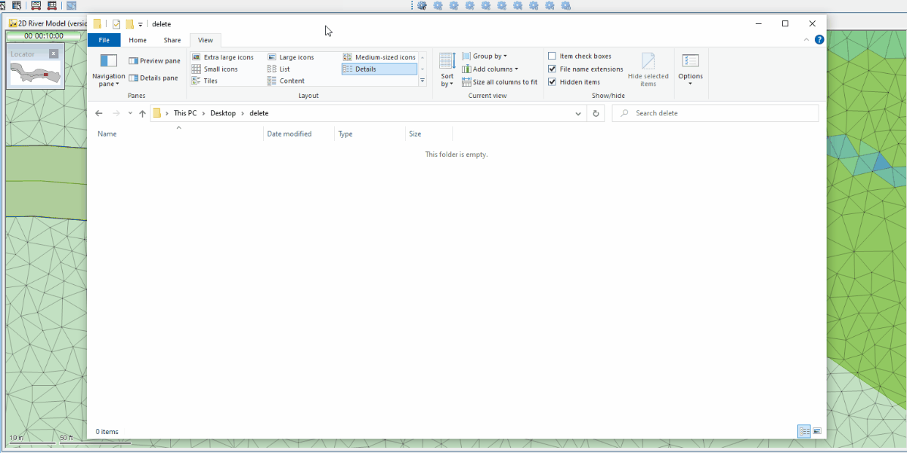

# Replace flags in all objects in a model network
This script exports water quality timestep results from _network results point 1D_ objects from an active simulation in the GeoPlan into a CSV file. It prompts the user to select an export folder. The CSV structure is built in the Ruby script itself.

Props to @ngerdts7

