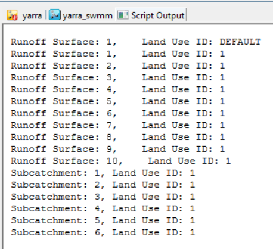

# Runoff Surface and Land Use Selection Script

This script selects all subcatchments in an InfoWorks ICM model network that use a specified set of runoff surfaces and land uses.

## How it Works

1. The script first accesses the current network.

2. It then creates a hash to store the IDs of the selected runoff surfaces, and populates this hash with the IDs of the currently selected runoff surfaces in the network.

3. The script creates another hash to store the IDs of the selected land uses. It iterates over each land use in the network, and for each land use, it checks each runoff surface index. If the runoff surface index matches one of the selected runoff surfaces, the land use is added to the selected land uses hash and is selected in the network.

4. Finally, the script iterates over each subcatchment in the network. If a subcatchment's land use ID matches one of the selected land uses, the subcatchment is selected.

## Usage

To use this script, simply run it in the context of an open network in InfoWorks ICM. Before running the script, you should select the runoff surfaces that you are interested in. The script will then select all land uses that use these runoff surfaces, and all subcatchments that use these land uses.

## Naming Convention

The naming convention for tables in InfoWorks ICM is different. Instead of starting with sw_, tables in ICM usually start with hw_ (for "HydroWorks", the original name of InfoWorks ICM). The field names within these tables can also be different between SWMM and ICM.  Ruby code with the prefix hw_sw can be used in both ICM InfoWorks and SWMM Networks