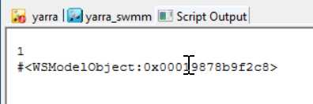

# Model Object Parent Retrieval Script

This script retrieves the parent of a model object in an InfoWorks ICM model network.

## How it Works

1. The script first accesses the current database and network, and retrieves the model object from the network.

2. It then gets the ID of the parent of the model object.

3. The script attempts to retrieve the parent object from the database as a 'Model Group'. If this is successful, it prints the parent ID and the parent object.

4. If the attempt to retrieve the parent object as a 'Model Group' raises an exception (which would happen if the parent object is not a 'Model Group'), the script catches the exception and instead retrieves the parent object as a 'Model Network'. It then gets the ID of the parent of this object and retrieves this parent object as a 'Model Group', printing the parent ID and the parent object.

## Usage

To use this script, simply run it in the context of an open network in InfoWorks ICM. The script will automatically retrieve the parent of the model object and print the parent ID and the parent object.

## Naming Convention

The naming convention for tables in InfoWorks ICM is different. Instead of starting with sw_, tables in ICM usually start with hw_ (for "HydroWorks", the original name of InfoWorks ICM). The field names within these tables can also be different between SWMM and ICM.  Ruby code with the prefix hw_sw can be used in both ICM InfoWorks and SWMM Networks