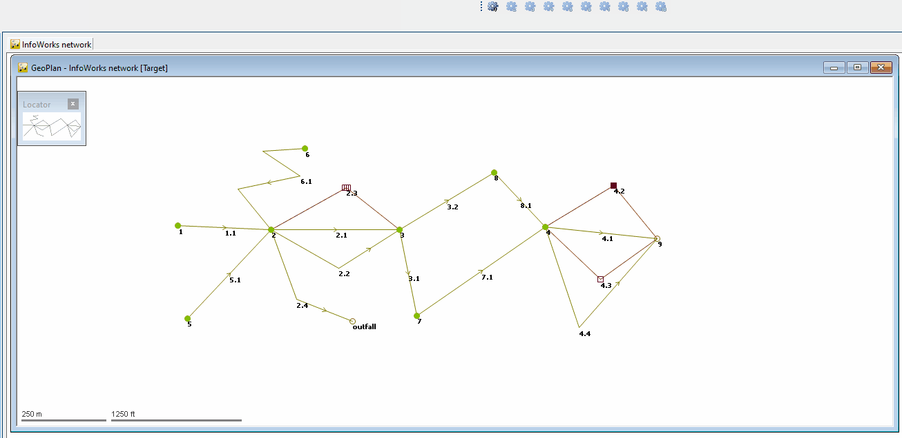
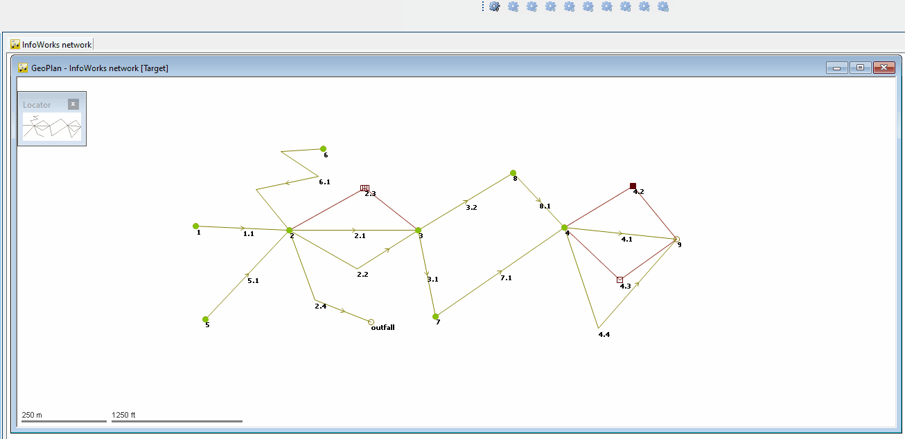

# Trace network downstream or upstream of selected object
These scripts allow tracing all assets upstream or downstream of a selected node or link.
## Version 1 - Trace network downstream of selected node

## Version 2 - Trace network upstread of selected node

## Version 3 - Trace network downstream of selected link

## Version 4 - Trace network upstread of selected link
