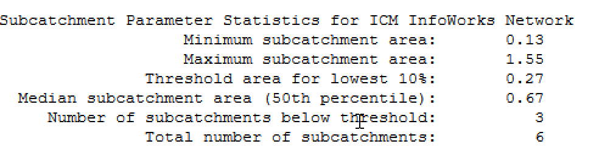

# Ruby Script: Subcatchment Parameter Statistics

This script is used to calculate and print statistics for subcatchments in both the current network and the background network in an InfoWorks ICM application.

## Steps

1. The script initializes the current network and the background network.

2. For each network, the script does the following:
   - Clears any existing selection.
   - Initializes an array to store subcatchment areas.
   - Loops through each subcatchment in the network and adds the total area of the subcatchment to the array if it exists.
   - Calculates the threshold area for the lowest ten percent by adding 10% of the range of areas to the minimum area.
   - Calculates the median area (50th percentile) by sorting the areas and selecting the middle one.
   - Initializes an array to store the selected subcatchments.
   - Loops through each subcatchment in the network again and selects it if the total area of the subcatchment is below the threshold or median.
   - Calculates the total number of subcatchments.
   - If any subcatchments were selected, it prints the statistics including minimum subcatchment area, maximum subcatchment area, threshold area for lowest 10%, median subcatchment area (50th percentile), number of subcatchments below threshold, and total number of subcatchments.



## Ruby Code

```ruby
# ... (code omitted for brevity)

# usage example
net = WSApplication.current_network
bn = WSApplication.background_network

# Print the table results
print_table_results(net,bn)


