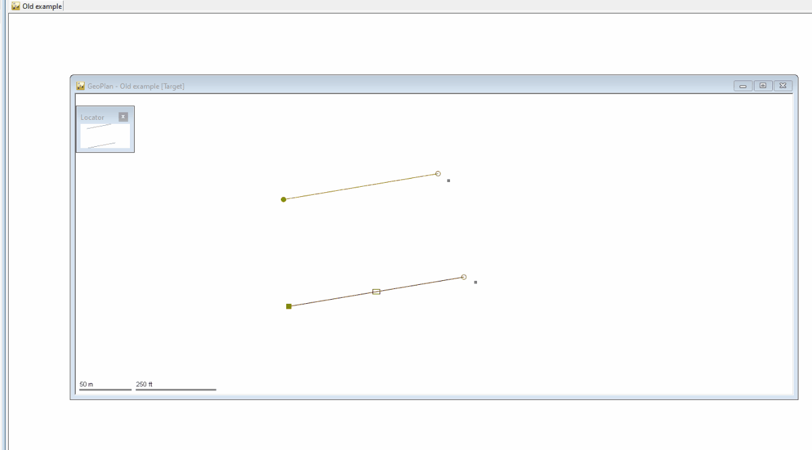

# Running an Exchange script from the UI
This example shows how to run a Ruby script from the ICM UI which triggers an Exchange script.

Load the `UI_script.rb` script in ICM. This runs the `EX_script.rb` script in Exchange. It also passes arguments from the UI to the Exchange script.



## Technical note
The `UI_script.rb` script uses the `system()` method, which can pass command line strings to the shell. The command passed to the `system()` method must be surrounded by double-quotes. For example:

In Ruby:
```ruby
system("echo hello world")
```
Is equivalent to running the following command in shell:
```bat
echo hello world
```
Which outputs:
```
hello world
```

In this example, the `system()` method will run the `IExchange.exe` process. In turn, this process needs arguments, such as:
- which Exchange script it is supposed to run (`EX_script.rb` in this example)
- in what product should it run the script (ICM/IAM)
- any arguments the user might want to pass to the Exchange script

Arguments for the `IExchange.exe` process must also be surrounded by double-quotes in case they have spaces. Otherwise, they would be interpreted as separate individual arguments. This means the double-quotes used for the `IExchange.exe` arguments need to be escaped so the `system()` method does not confuse them with its own double-quotes.

Escaping double-quotes is done by using `\"`. These can then be used to surround the `IExchange.exe` arguments which might contain spaces, and avoid the shell interpreting them as separate arguments.

In this line:
```ruby
system("\"#{$exchange_path}\" \"#{$script_path}\" ICM \"#{$param1}\" \"#{$param2}\"")
```
The system method has five arguments which are interpreted as:
````
1. "C:/where iexchange.exe is/"
2. "E:/where the script it will run is/"
3. ICM (or IAM)
4. "argument number one"
5. "argument number two"
````

### Launcher differences (`IExchange.exe` vs `ICMExchange.exe`)

This example targets the legacy `IExchange.exe` launcher and explicitly passes `ICM` as argument 3.

The two launchers inject different values into `ARGV`, as confirmed by testing:

| Launcher | Auto-injected | ARGV[0] | First user arg |
|---|---|---|---|
| `IExchange.exe script.rb ICM ...` | nothing — `ICM` is user-supplied | `"ICM"` | `ARGV[1]` |
| `ICMExchange.exe script.rb ...` | `"ADSK"` | `"ADSK"` | `ARGV[1]` |

For `ICMExchange.exe`:
- Do **not** pass `ICM` manually — it is not required and the wrapper does not expect it.
- Your user arguments still start at `ARGV[1]` (after the auto-injected `"ADSK"`).

To reduce Windows path escaping issues, prefer forward slashes (`C:/path/to/file.rb`) or use escaped backslashes (`C:\\path\\to\\file.rb`).

Please check the Ruby documentation for more information about the [`system()`](https://apidock.com/ruby/Kernel/system) method.

The example has a number of hard coded variables for simplicity. This includes running on the 64-bit version of ICM and using a `E:/Scripts` folder as the location of the `EX_script.rb` script.
