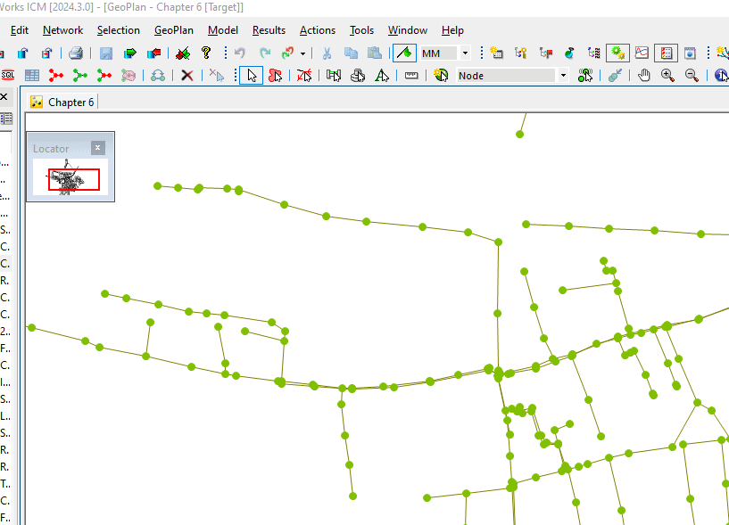

# Select Flow Path Between Two Nodes

Highlights the shortest path between two manually selected nodes.

## Usage
1. Select two nodes in GeoPlan (hold `Ctrl` for the second node)
2. Run the script
3. Path between nodes is highlighted

## How It Works
- Uses Dijkstra's algorithm to find the shortest path
- Searches bidirectionally (both upstream and downstream)
- Highlights the complete path between the selected nodes

## Use Cases
- Visualizing flow routes between specific points
- Verifying network connectivity
- Quick path analysis

## See Also
For **automated batch tracing** from all terminal nodes to selected targets, see folder **0078 - Trace all flow paths to downstream nodes**.