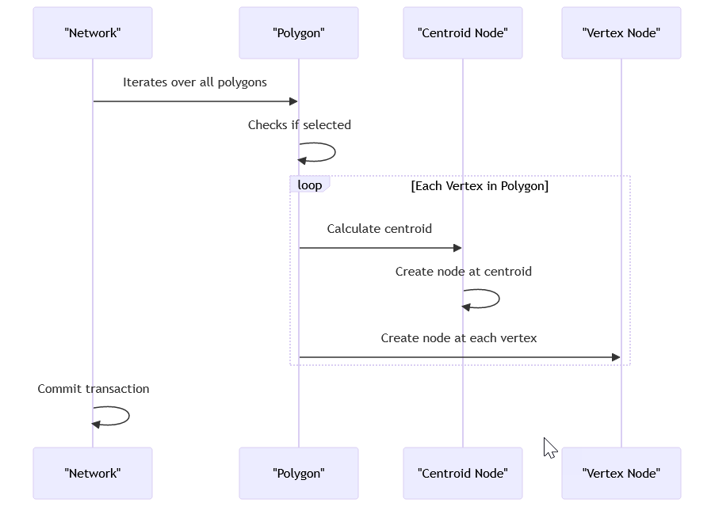

# Ruby Code for Generating Polygon Boundaries in InfoWorks ICM

This Ruby script is used to generate the boundaries for polygons with a specified number of sides in the InfoWorks ICM software. Here's a summary of what it does:

1. **Get the current network object**: The script starts by getting the current network object using `WSApplication.current_network`.

2. **Begin a transaction**: It then begins a transaction using `net.transaction_begin`. This allows all changes to be committed at once at the end of the script.

3. **Define a function to generate the boundary for a polygon**: The `generate_polygon_boundary` function is defined. This function takes a boundary array and a number of sides as arguments. It calculates the minimum and maximum x and y coordinates, the width and height, and then generates the points of the polygon. It returns the polygon boundary.

4. **Iterate over all polygon objects in the network**: The script then iterates over all polygon objects in the network using `net.row_object_collection('hw_subcatchment').each`. For each polygon, it checks if the polygon is selected. If it is, it gets the boundary array of the polygon, generates a new boundary array with a specified number of sides, and then sets the new boundary array.

5. **Commit the transaction**: Finally, the script commits the transaction using `net.transaction_commit`, making all changes permanent.

