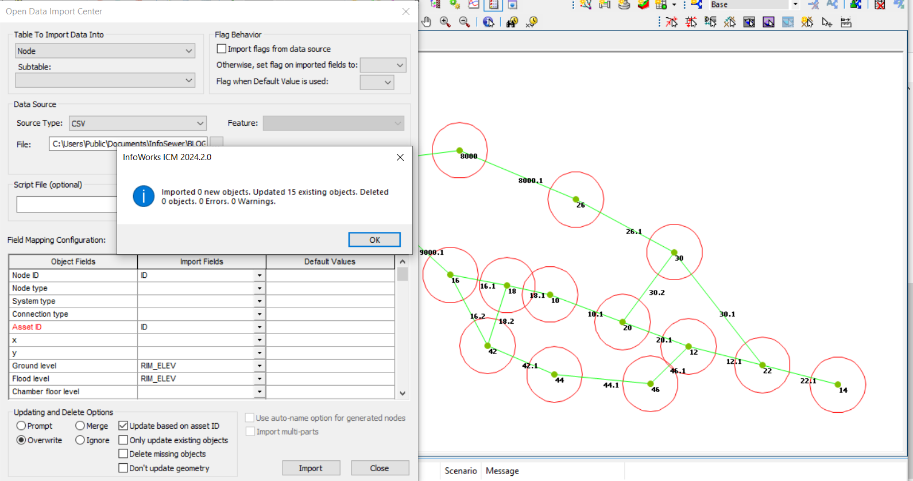
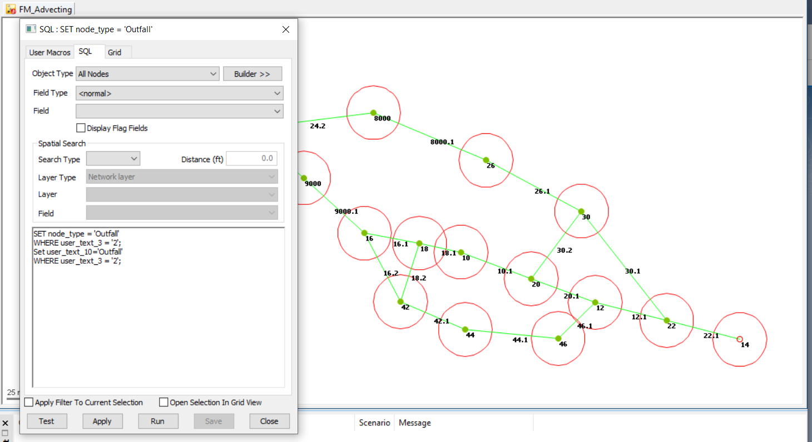

# Step 3 - Import Manhole Hydraulics using ODIC

1. Import the file MHHYD.CSV in the IEDB folder using the ODIC and the CFG file Step3_InfoSewer_manhole_hydraulics_mhhyd_csv.cfg

What is imported?  The manhole Rim Elevation and Flood Level

2.  Use the SQL script SET node_type = 'Outfall' to convert some manholes to Outfalls based on the node type imported when the Manhole CSV file was imported.

