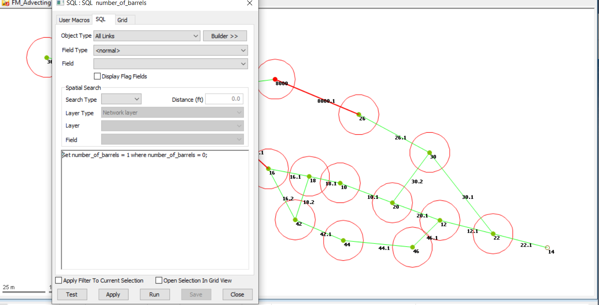

# Step 4 - Import Link Hydraulics using ODIC

1. Import the file PIPEHYD.CSV in the IEDB folder using the ODIC and the CFG file Step04_InfoSewer_link_hydraulics_pipehyd_csv.cfg

We now import the pipe lengths, roughness, diameter and inverts from the pipe hydraulics CSV file.

2. Often the barrels are undefined in InfoSewer, in which case InfoSewer assumes it is 1.  We do the same with the SQL script number_of_barrels.  Use the SQL to set the zero barrels to 1.

