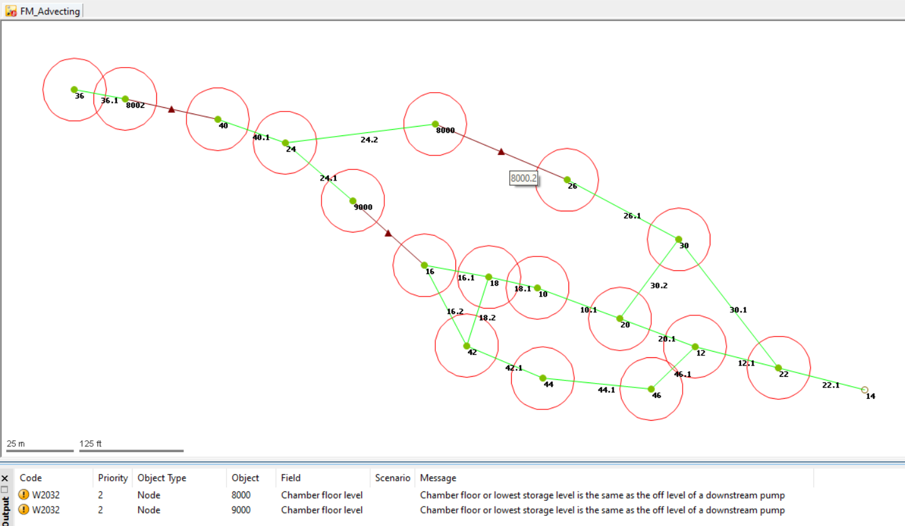

# Step 8 - Import Wet Well Hydraulics using ODIC

## Step 1: Import Wet Well Elevations Using ODIC

Objective: The goal of this step is to import data related to Wet Well elevation from InfoSewer for further analysis. These Wet Wells will be converted into manholes in ICM.

## How to Execute:

Navigate to the ODIC in the ICM interface.\
Locate the IEDB folder and select the file named WWELLHYD_CSV.\
Use the Configuration File (CFG) named Step08_Infosewer_wetwell_wwellhyd_csv.cfg for the import settings.

## What Gets Imported:

The bottom and top elevations of Wet Wells are imported into the software.
These Wet Wells are now treated as manholes within ICM.

## Step 2: Use SQL Scripts for Data Corrections and Conversions
SET pump on and off:\
This SQL script may need to be executed again to ensure that the pump's on/off settings are accurately represented in the model.

SET FM roughness:\
Run this script if you encounter errors related to roughness coefficients in the model.

SET caclulate manhole area:\
This script will convert manhole diameters into areas, which is the format required for ICM.

SET calculate wet well area:\
This SQL script will convert wet well diameters into shaft and chamber areas for nodes in ICM.

## Step 3: Perform Validation Checks
Objective: To ensure that all imported and adjusted data is accurate, and that the model is ready for simulations or further analysis.

## How to Execute:

Run the validation tool available in ICM.
Outcome:

The validation process should complete without any errors. If errors do occur, revisit the previous steps and correct the discrepancies before proceeding.

