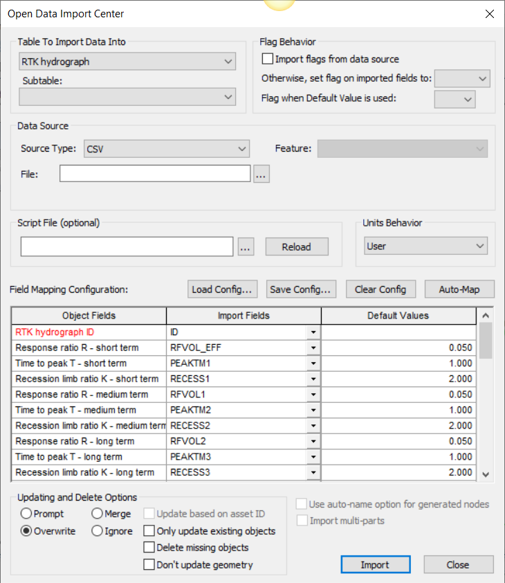

### Step 9: Configuration for Rainfall-Dependent Infiltration and Inflow (RDII) hydrographsRDII Hydrograph

InfoSewer Hydrograph data: An explanation

Using RDII or RTK or I&I Hydrographs in #INFOSEWER – InfoSewer from Innovyze has the features to model Infiltration/Inflow from Rainfall Events into a Sanitary or Combined Sewershed. There are three parameters - R, T, and K, a Sewershed Area, and a fraction division that divides up the overall R to the individual Rs.

Let's consider the following example:

The overall R (percent of Rainfall that turns into RDII): 10%
R1, R2, and R3 are the individual Rs.
The fraction division for R1, R2, and R3 is 0.2, 0.4, and 0.4, respectively.
Now, we can calculate the individual Rs as follows:

a. R1 = 0.2 × 10 / 100 = 0.02 b. R2 = 0.4 × 10 / 100 = 0.04 c. R3 = 0.4 × 10 / 100 = 0.04

So, the individual Rs are R1 = 0.02, R2 = 0.04, and R3 = 0.04.

