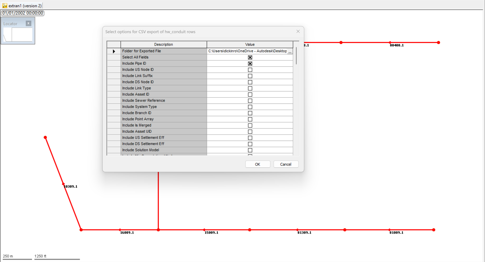
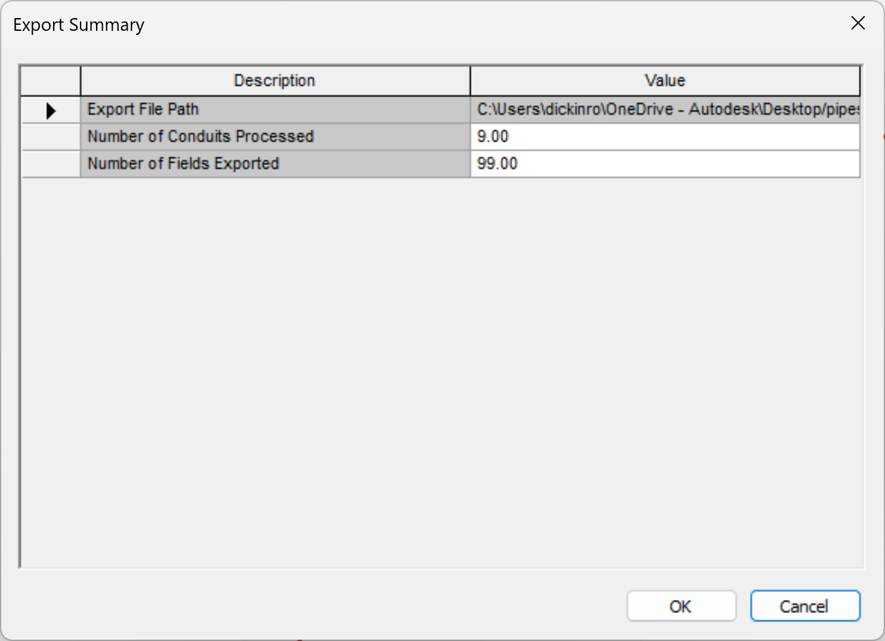
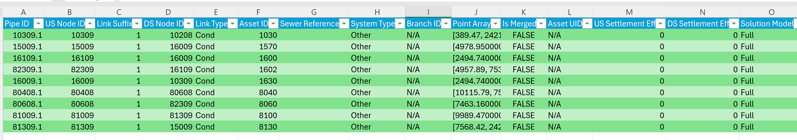

# Ruby Script Summary: WSApplication Conduit Data Exporter

## Overview

This Ruby script is designed to run within the `WSApplication` environment (typically InfoWorks ICM or similar Innovyze products). Its primary purpose is to export data associated with conduit objects (table `hw_conduit`) from the currently loaded network into a Comma Separated Value (CSV) file. The script provides a user interface to select which specific data fields (attributes) should be included in the export.

## Key Features

* **Selective Export:** Users can choose exactly which conduit attributes (e.g., Pipe ID, US Node ID, Conduit Width, Material, User Fields, etc.) they want to export via a checklist prompt.
* **"Select All" Option:** A convenient "Select All Fields" checkbox allows users to quickly choose all available fields for export, overriding individual selections.
* **Custom Output Location:** The user specifies the destination folder for the generated CSV file using a folder selection dialog integrated into the prompt.
* **Dynamic Configuration:** The list of exportable fields is defined in a central configuration array (`FIELDS_TO_EXPORT`), making it easy to add, remove, or modify available fields without changing the core logic.
* **Timestamped Filename:** The output CSV file includes a timestamp (YYYYMMDD_HHMMSS) in its name to prevent accidental overwriting of previous exports.
* **Error Handling:** Includes checks for:
    * A currently loaded network.
    * User cancellation of the prompt.
    * Valid export folder selection.
    * Permissions to create the directory and write the file.
    * Potential errors during attribute access for individual conduits (reports warnings without stopping the entire export).
    * File system errors (e.g., disk full).
* **User Feedback:** Provides console messages about progress, start/end times, duration, and displays a final summary prompt with the export file path and counts of processed conduits and exported fields.
* **Nil Value Handling:** Replaces `nil` (missing) values in the network data with the string "N/A" in the output CSV for clarity.

## Dependencies

* **Ruby:** The script is written in Ruby.
* **`csv` library:** Standard Ruby library for CSV file operations.
* **`fileutils` library:** Standard Ruby library used here for directory operations (though `Dir.mkdir` is sufficient).
* **`WSApplication` Environment:** The script relies heavily on the `WSApplication` API provided by the host software (e.g., InfoWorks ICM) to interact with the network data and display prompts.

## How it Works

1.  **Initialization:** Requires the `csv` library.
2.  **Configuration:** Defines all potential fields to export in the `FIELDS_TO_EXPORT` constant array. Each entry specifies the prompt label, the internal attribute name, the default checkbox state, and the CSV header name.
3.  **Network Check:** Verifies that a network is currently loaded in the `WSApplication`. Exits if not.
4.  **Build Prompt:** Dynamically creates the list of options for the `WSApplication.prompt` based on `FIELDS_TO_EXPORT`, adding the 'Folder' selection and the 'Select All Fields' checkbox at the beginning.
5.  **User Interaction:** Displays the prompt to the user. Exits if the user cancels.
6.  **Process Selections:**
    * Retrieves the selected export folder path and the state of the "Select All" checkbox from the prompt results.
    * If "Select All" is checked, it populates the `selected_fields` list with *all* fields defined in `FIELDS_TO_EXPORT`.
    * If "Select All" is *not* checked, it iterates through the remaining prompt results, adding only the individually checked fields to the `selected_fields` list.
7.  **Prepare Output:**
    * Ensures the target export folder exists, creating it if necessary (with error handling for permissions).
    * Constructs the full path for the output CSV file, including a timestamp.
    * Builds the CSV `header` row based on the `selected_fields`.
8.  **Export Data:**
    * Opens the CSV file for writing.
    * Writes the generated `header` row.
    * Iterates through each `hw_conduit` row object in the current network (`cn.row_objects('hw_conduit')`).
    * For each conduit:
        * Initializes an empty array for the row data.
        * Iterates through the `selected_fields`.
        * Retrieves the value for each selected attribute from the conduit object (`pipe.send(attribute_name)`).
        * Handles `nil` values (replacing with "N/A") and catches potential errors if an attribute doesn't exist, logging a warning.
        * Adds the retrieved (or placeholder) value to the row data array.
        * Writes the completed row data array to the CSV file.
    * Keeps track of the number of conduits processed.
9.  **Completion & Summary:**
    * Logs the end time and calculates the duration.
    * Displays a final `WSApplication.prompt` summarizing the operation, including the output file path, the number of conduits processed, and the number of fields exported per conduit.

## Configuration (`FIELDS_TO_EXPORT`)

The core flexibility of the script comes from the `FIELDS_TO_EXPORT` array. To add a new exportable field:

1.  Find the internal attribute name used by `WSApplication` for the desired data (e.g., `:user_text_11`).
2.  Add a new entry to the array:
    ```ruby
    ['Include User Text 11', :user_text_11, false, 'User Text 11']
    # [Prompt Label,       Attribute Symbol, Default?, CSV Header]
    ```

To remove a field, simply delete its corresponding line from the array. To change the default state (checked/unchecked) or the CSV header, modify the relevant element in the field's configuration line.

## Usage Notes

* This script must be run from within the scripting interface of a compatible `WSApplication` environment (like the Ruby Script editor in InfoWorks ICM).
* Ensure the user running the script has write permissions in the selected export folder.
* For very large networks, consider commenting out the progress update line inside the loop if performance is critical, although basic logging is usually negligible.




    
](image-2.png)


