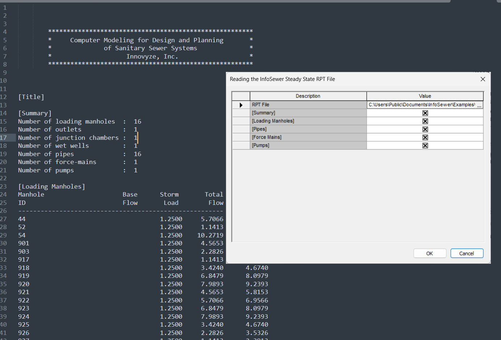

# InfoSewer RPT File Reader Documentation

## Overview

This Ruby script is designed to read and analyze InfoSewer Steady State Report (RPT) files within the WSApplication environment. It parses multiple sections of the RPT file, calculates statistical summaries, and outputs data in CSV format for further analysis.

## Features

### Core Functionality
- Interactive file selection dialog
- Selective section processing based on user preferences
- Statistical analysis (mean, max, min, count) for numerical data
- CSV output for manholes and links (pipes, pumps, force mains)

### Supported RPT Sections
1. **Summary** - General system summary information
2. **Loading Manholes** - Manhole loading data (Base, Storm, Total loads)
3. **Pipes** - Gravity sewer pipe hydraulic data
4. **Force Mains** - Pressurized pipe data
5. **Pumps** - Pump station operational data

## Script Structure

### 1. User Interface Dialog
The script begins by presenting a dialog box where users can:
- Select the RPT file to process
- Choose which sections to analyze using checkboxes

### 2. File Validation
- Verifies the selected file exists
- Checks for valid file path
- Handles user cancellation gracefully

### 3. Data Parsing Engine

#### Section Headers Configuration
The script defines specific headers for each section type:

- **Loading Manholes**: Base, Storm, Total
- **Pumps**: Pump Count, Pump Flow, Pump Head
- **Force Mains**: Pipe Diam, Pipe Flow, Pipe Vel., Pipe Loss
- **Pipes**: 16 different metrics including flow, velocity, depth, etc.

#### Parsing Logic
1. Identifies section boundaries marked by `[Section Name]`
2. Skips the first 3 lines of each section (headers)
3. Applies section-specific column shifts:
   - Pipes: Skip 2 columns after ID
   - Force Mains: Skip 2 columns after ID
   - Pumps: Skip 3 columns after ID
4. Converts string values to floats for numerical analysis

### 4. Statistical Analysis
For each selected section, the script calculates:
- **Mean** - Average value for each metric
- **Max** - Maximum value found
- **Min** - Minimum value found
- **Count** - Number of valid data points

Output format:
```
Section: [Section Name]
  [Metric Name]        | Mean: [value]      | Max: [value]       | Min: [value]       | Count: [number]
```

### 5. CSV Output Generation

#### Loading Manholes CSV
Format:
```csv
ID,Base,Storm,Total
MH001,1.23,0.45,1.68
MH002,2.34,0.56,2.90
```

#### Links CSV (Combined Output)
Combines all link types into a unified format:
```csv
ID,Type,Diameter,Flow,Velocity,Depth_Ratio
P001,Pipe,12.0,45.6,3.2,0.75
FM001,Force Main,8.0,23.4,5.6,1.0
PMP001,Pump,0.0,123.4,0.0,0.0
```

## Key Technical Details

### Data Cleaning
- Handles special cases like "Exponential 3-Point" text that could break tokenization
- Strips whitespace and skips empty lines
- Validates numeric conversions with error handling

### Error Handling
- Graceful handling of missing values (defaults to 0.0)
- Validation of array bounds before accessing indices
- Nil checking for robust operation

### Section-Specific Processing
Each section type has unique characteristics:
- **Pipes**: Most complex with 16 data columns
- **Force Mains**: Always full (depth_ratio = 1.0)
- **Pumps**: No diameter or traditional velocity metrics

## Usage Requirements

### Environment
- Requires WSApplication environment (InfoSewer/InfoSWMM)
- Ruby runtime within the application
- Access to RPT files from InfoSewer steady-state analysis

### Input File Format
The RPT file must follow the standard InfoSewer format:
- Section headers enclosed in brackets: `[Section Name]`
- Tab or space-delimited data
- First column contains element IDs
- Minimum 3 header lines per section

## Output Examples

### Statistical Summary
```
Section: Pipes
  Pipe Flow 1          | Mean: 45.678       | Max: 123.450      | Min: 0.100        | Count: 150
  Pipe Veloc           | Mean: 3.245        | Max: 8.900        | Min: 0.050        | Count: 150
```

### CSV Output
The script generates two CSV sections that can be easily copied for use in spreadsheet applications or further processing:
1. Manhole loads with individual base, storm, and total values
2. Combined links data with unified structure for all link types

## Customization Options

### Adding New Sections
To add support for additional RPT sections:
1. Add section name to the dialog prompt
2. Define headers array for the new section
3. Add section-specific token shift logic if needed
4. Include in statistical analysis case statement

### Modifying Output Format
The CSV output format can be customized by modifying the output sections at the end of the script. Additional fields can be added by accessing different indices from the parsed data arrays.

## Best Practices

1. **Always verify** the RPT file format matches expected structure
2. **Test with small files** first to ensure proper parsing
3. **Check statistical results** for reasonableness
4. **Save CSV output** immediately if needed for further analysis
5. **Monitor memory usage** with very large RPT files

## Limitations

- Requires specific RPT file format from InfoSewer
- Statistical analysis limited to numerical data
- CSV output goes to console (not directly to file)
- Some data transformations are hard-coded (e.g., force main depth_ratio)

## Future Enhancement Possibilities

1. Direct CSV file export option
2. Additional statistical metrics (standard deviation, percentiles)
3. Graphical visualization of results
4. Batch processing of multiple RPT files
5. Custom header mapping configuration
6. Export to InfoSewer model attributes

