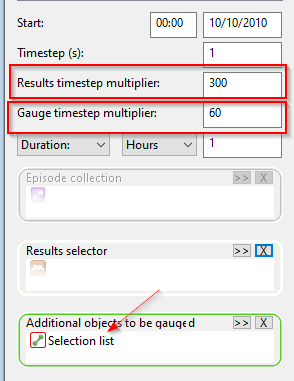

# Getting results from all timesteps
The script in this example returns `depnod` results of selected nodes for all simulation timesteps. This can be expanded to include other tables or results fields, but that is outside the scope of the example.

## Technical note
The two main methods in this script are `list_timesteps`/`list_gauge_timesteps` and `results`/`gauge_results`. The script matches the simulation timesteps array with results array. In case the simulation contains "gauged" results, the script returns the results at the gauged timestep.

