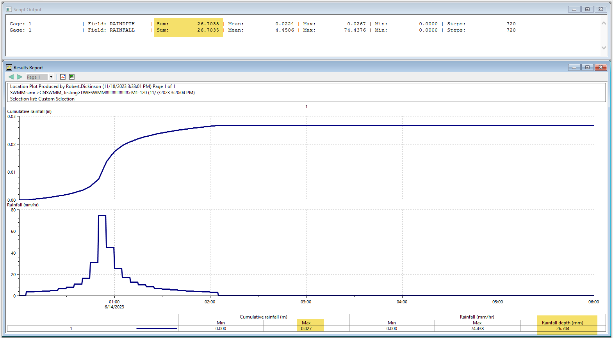

# Ruby Script Summary: Statistics Calculation for Rain Gages in an ICM SWMM Netowork

## Overview
This Ruby script is designed to calculate and display statistical data for selected rain gages in an InfoWorks network. It utilizes the InfoWorks API to access network data and compute various statistics for specified result fields.

## Script Details
- **Library Import**: The script starts by requiring the `date` library for handling dates.
- **Network Access**: It accesses the current network object from InfoWorks.
- **Timesteps and Results Handling**:
  - Retrieves the count and list of timesteps in the network.
  - Defines result field names (`'RAINDPTH'`, `'RAINFALL'`) for which statistics will be calculated.
- **Iteration Over Selected Objects**:
  - Iterates through each selected object in the network.
  - Fetches the row object for the current rain gage based on its ID.
  - Raises an error if the object is not a gage.
- **Statistics Calculation**:
  - For each result field, checks if the count of results matches the count of timesteps.
  - Initializes variables for total, total integrated over time, min, max, and count.
  - Calculates total, min, max values, and mean for the results.
  - Adjusts total integrated over time by dividing it by 3600.0.
  - Specifically, for `RAINDPTH`, modifies the total integrated over time.
- **Output**:
  - Prints calculated statistics for each gage and result field.

## Error Handling
- Handles errors related to non-existent fields.
- Catches and outputs errors during the processing of objects.

# SWMM Rain Gage Properties

## Name
User-assigned rain gage name.

## X-Coordinate
Horizontal location of the rain gage on the Study Area Map. If left blank then the rain gage will not appear on the map.

## Y-Coordinate
Vertical location of the rain gage on the Study Area Map. If left blank then the rain gage will not appear on the map.

## Description
Click the ellipsis button (or press Enter) to edit an optional description of the rain gage.

## Tag
Optional label used to categorize or classify the rain gage.

## Rain Format
Format in which the rain data are supplied:
- **INTENSITY**: each rainfall value is an average rate in inches/hour (or mm/hour) over the recording interval.
- **VOLUME**: each rainfall value is the volume of rain that fell in the recording interval (in inches or millimeters).
- **CUMULATIVE**: each rainfall value represents the cumulative rainfall that has occurred since the start of the last series of non-zero values (in inches or millimeters).

## Rain Interval
Recording time interval between gage readings in decimal hours or hours:minutes format.

## Snow Catch Factor
Factor that corrects gage readings for snowfall.

## Data Source
Source of rainfall data; either **TIMESERIES** for user-defined time series data or **FILE** for an external data file.

### TIME SERIES

- **Series Name**: Name of time series with rainfall data if Data Source selection was TIMESERIES; leave blank otherwise (double-click to edit the series).

### DATA FILE

- **File Name**: Name of external file containing rainfall data (see Rainfall Files).
- **Station No.**: Recording gage station number.
- **Rain Units**: Depth units (IN or MM) for rainfall values in user-prepared files (other standard file formats have fixed units depending on the format).

| Header 1 | Header 2 |
|----------|----------|
| Cell 1   | Cell 2   |
| Cell 3   | Cell 4   |

> This is a blockquote.

*italic* or _italic_
**bold** or __bold__
**_bold and italic_** or *__bold and italic__*
~~strikethrough~~

# Header 1
## Header 2
### Header 3
#### Header 4
##### Header 5
###### Header 6

1. First item
2. Second item
   1. Sub-item 1
   2. Sub-item 2

