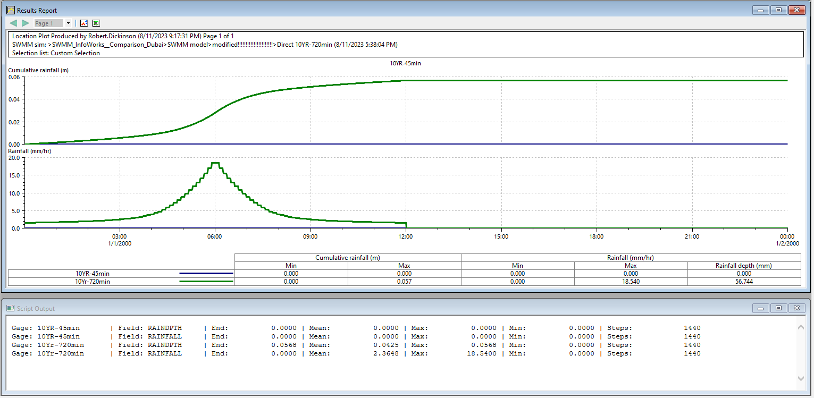

The script analyzes rainfall data from selected rain gauges in the ICM SWMM Network. Here's a concise summary:

The script accesses rainfall data from selected rain gauges in the ICM SWMM Network to compute various statistical metrics.

# Key steps and features:

The script starts by importing the required 'date' library.
It fetches the current ICM SWMM Network and retrieves the list of time steps.
The script targets two specific rainfall data fields: 'RAINDPTH' (Rain Depth) and 'RAINFALL'.

# For each selected rain gauge:
The script ensures the targeted object is indeed a rain gauge.
For each data field, it checks if the count of results matches the count of time steps.
If they match, it proceeds to calculate various statistics:
### Total rainfall
### Rainfall integrated over time
### Mean rainfall
### Maximum and minimum rainfall values
### Total number of data points (time steps)
Results for each gauge and field are printed in a structured format.

Error handling mechanisms are in place to manage situations where targeted fields are absent or other unexpected issues arise.
The script efficiently computes and presents a comprehensive overview of rainfall data, enabling a user to gain insights into rainfall patterns and intensities from the selected rain gauges in the ICM SWMM Network.

# SWMM Rain Gage Properties

## Name
User-assigned rain gage name.

## X-Coordinate
Horizontal location of the rain gage on the Study Area Map. If left blank then the rain gage will not appear on the map.

## Y-Coordinate
Vertical location of the rain gage on the Study Area Map. If left blank then the rain gage will not appear on the map.

## Description
Click the ellipsis button (or press Enter) to edit an optional description of the rain gage.

## Tag
Optional label used to categorize or classify the rain gage.

## Rain Format
Format in which the rain data are supplied:
- **INTENSITY**: each rainfall value is an average rate in inches/hour (or mm/hour) over the recording interval.
- **VOLUME**: each rainfall value is the volume of rain that fell in the recording interval (in inches or millimeters).
- **CUMULATIVE**: each rainfall value represents the cumulative rainfall that has occurred since the start of the last series of non-zero values (in inches or millimeters).

## Rain Interval
Recording time interval between gage readings in decimal hours or hours:minutes format.

## Snow Catch Factor
Factor that corrects gage readings for snowfall.

## Data Source
Source of rainfall data; either **TIMESERIES** for user-defined time series data or **FILE** for an external data file.

### TIME SERIES

- **Series Name**: Name of time series with rainfall data if Data Source selection was TIMESERIES; leave blank otherwise (double-click to edit the series).

### DATA FILE

- **File Name**: Name of external file containing rainfall data (see Rainfall Files).
- **Station No.**: Recording gage station number.
- **Rain Units**: Depth units (IN or MM) for rainfall values in user-prepared files (other standard file formats have fixed units depending on the format).

| Header 1 | Header 2 |
|----------|----------|
| Cell 1   | Cell 2   |
| Cell 3   | Cell 4   |

> This is a blockquote.

*italic* or _italic_
**bold** or __bold__
**_bold and italic_** or *__bold and italic__*
~~strikethrough~~

# Header 1
## Header 2
### Header 3
#### Header 4
##### Header 5
###### Header 6

1. First item
2. Second item
   1. Sub-item 1
   2. Sub-item 2

