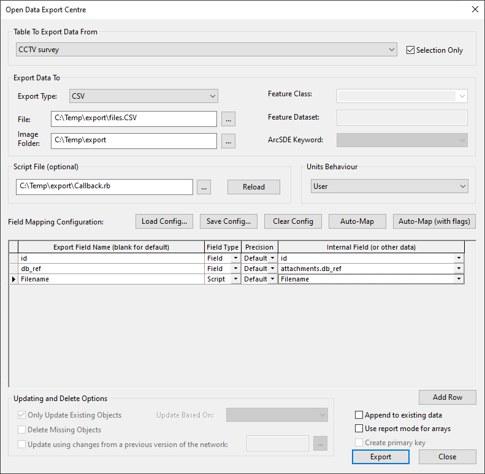
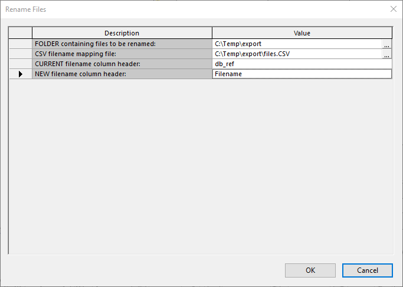

# Renaming Exported Attachment Files
Within the InfoAsset Manager you can export images and attachment files which are stored against an object using the standard export methods available.  

When exporting these attachment files, they are exported with a GUID filename - which is what they are stored using within the Master Database.
Currently there is no built-in utility to rename/define a file's filename when exporting from the database.  

The scripts here will resolve this, allowing bulk renaming of files using a simple CSV mapping file.  

The script is designed to prevent overwriting of files by means of renaming a file to a filename already in use within the folder.  
If this happens, the Script Output will try and append the new filename with an index number based on the line in the CSV[^1].  The outputted log will detail the file renamings which have occured.  
Note, we cannot be held liable if the script does overwrite any files.  
[^1]: Handling of multiple proposed filenames being the same is in v4 & later of this script.  

## Renaming Already Exported Files
Script: **[UI-FileRename_v4.rb](./UI-FileRename_v4.rb)**  

The prerequisite of using this script is a CSV file which contains at least two columns - one which has the file's current filename (full filename including file type extension) and a column with the new filename (without file type extension), and that the files to be renamed are all located within one folder.  

### Exporting the files & CSV from Infoasset Manager
For example, I have the below CCTV Survey with some attachments.  
  
*Attachments dialog for a CCTV Survey.*  

I export the Object ID, the file reference - to export the file itself, and the proposed new filename - either generated using SQL/Script.  
  
*ODEC, exporting only the necessary fields.*  

Note, that because these attachments are a blob field, to generate the proposed filename I had to use a Script callback class (on ODEC line 3) - see the [0001A ODEC Callback Examples GitHub repository](../0001A%20ODEC%20Callback%20Examples/) for examples such as this.  
The Callback class syntax I used in this example is:  
```ruby
class Exporter
    def Exporter.Filename(obj)
        if !obj['attachments.purpose'].nil?
            name=obj['id']+'_'+obj['attachments.purpose']
            return name.gsub(/[^0-9A-Za-z _-]/, '')
        else
            name2=obj['id']
            return name2.gsub(/[^0-9A-Za-z _-]/, '')
        end
    end
end
```
Essentially what it is doing is returning the object value for the id field, followed by an underscore character, then the attachments.purpose field value concatenated together if the purpose field has a value, else it is just outputting the Object ID.  
The returned string then has any non-alphanumeric, spaces, underscores, or hyphens removed.  

So that I have a simple CSV file, as below, which I can use to rename the files as well as the files themselves.  
  
*CSV export in Excel*  


### Run the Ruby Script
Then I can run the script using the InfoAsset Manager interface (**Network** > **Run Ruby script...** > select the .rb file containing [UI-FileRename_v4.rb](./UI-FileRename_v4.rb)), when prompted selecting the folder where the files are, the mapping file, and the headers of the current & new filenames.  
  
*Script Parameters*  

Like magic, the files are renamed to something more meaningful as defined in the CSV. :satisfied:  
  
*Files pre and post renaming*  

