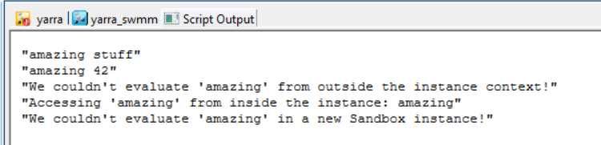

# Ruby Script Summary: Instance Evaluation and Class Scope

## Overview
This Ruby script showcases the use of class definitions and instance evaluations in Ruby. It involves defining two classes, `Monk` and `Sandbox`, and demonstrates the dynamic addition of methods to an instance of a class and their scope.

## Details
- **Class Definitions**: The script begins by defining two empty classes, `Monk` and `Sandbox`.
- **Instance Creation**: An instance of the `Sandbox` class, named `box`, is created.
- **Dynamic Method Definition**:
  - `instance_eval` is used on `box` to define an `amazing` method, returning `"amazing"`.
  - A `number` method is also defined, returning `42`.
  - These methods are demonstrated within the `box` instance.
- **Method Scope**:
  - An attempt to call `amazing` outside `box` fails, showing method scope limitation.
  - The `amazing` method is successfully called within the `box` instance.
- **Instance Specificity**:
  - A new `Sandbox` instance (`new_box`) is created.
  - An attempt to call `amazing` in `new_box` fails, indicating that the method is not shared across instances.

  

## Conclusion
This script effectively illustrates how `instance_eval` can be used to add methods dynamically to specific instances in Ruby and highlights the scope and accessibility of such methods.
