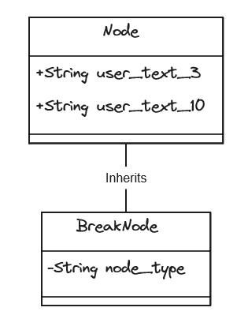

## Code Summary: Set Break Nodes in SWMM5 Model

This code snippet is used to set certain nodes as 'Break' nodes in a SWMM5 model. The specific criteria and actions are outlined below:

- **Object Type**: The script targets all nodes within the model.
- **Spatial Search**: There is no specific spatial search criterion set (indicated by 'blank').

### Code Execution:

1. **Setting Node Type**:
   - The `node_type` is set to `'Break'` for all nodes where the `user_text_3` attribute equals `'1'`.

2. **Updating User Text**:
   - The `user_text_10` attribute is set to `'Break'` for nodes where `user_text_3` is `'1'`.

