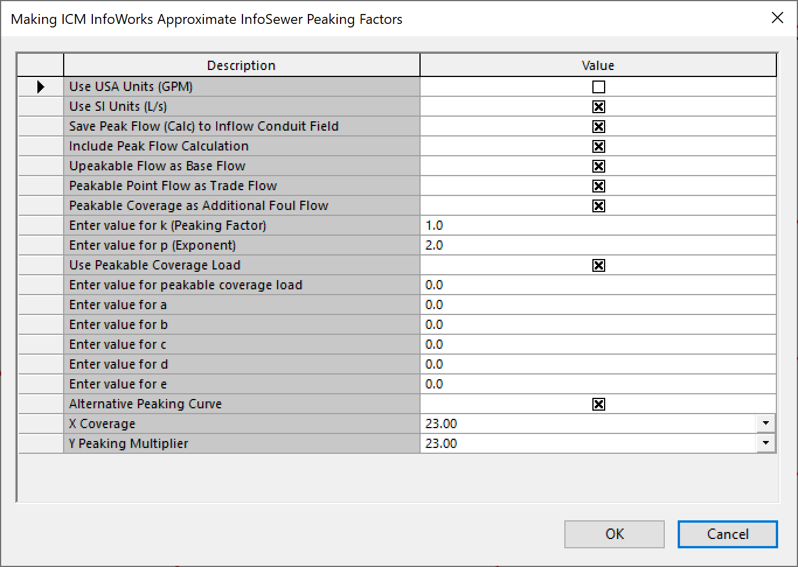

# Ruby Script: Approximate InfoSewer Peaking Factors in InfoWorks ICM

Below is a Ruby script designed for **InfoWorks ICM** that mimics InfoSewer‐style peaking factors while allowing users to specify key parameters via an interactive prompt. It then calculates and prints flow statistics (mean, min, max) for each selected link and optionally updates certain link attributes.

---

## 1. Purpose

- **Approximate InfoSewer Peaking:**  
  The script uses a power‐law expression (e.g., `peak_gpm = k * flow_value^p`) or the InfoSewer‐like formula `val * 2.6 / (val * 1.547)**0.16` (commented in the code) to compute a “peaked” flow, simulating the typical approach in InfoSewer for applying peaking factors to different flow components (base flow, trade flow, etc.).

- **Interactive Parameter Entry:**  
  Via `WSApplication.prompt`, engineers can quickly toggle unit systems (USA or SI), define whether to store calculated flow back to the model, and control more advanced curve parameters (`a`, `b`, `c`, etc.) if needed.

- **Printing & Storing Results:**  
  For each link, the script iterates over all timesteps of the simulation, collects flow results from the upstream node (`'us_flow'` field by default), computes peaking flows, and then prints out relevant statistics (mean, min, max). Optionally, it writes updated flow values into fields (`base_flow`, `trade_flow`, `additional_foul_flow`).

---

## 2. User Prompts

The script begins with:

```ruby
parameters = WSApplication.prompt "Making ICM InfoWorks Approximate InfoSewer Peaking Factors\n" \
  "Note: Unpeakable flow should be in the base flow column...",
[
  ['Use USA Units (GPM)', 'Boolean', false],
  ['Use SI Units (L/s)', 'Boolean', true],
  ...
  ['Enter value for k (Peaking Factor)', 'String', '1.0'],
  ['Enter value for p (Exponent)', 'String', '2.0'],
  ...
  ['Alternative Peaking Curve', 'Boolean', true],
  ['X Coverage', 'NUMBER', 23, nil, 'LIST', [0,1,5,10,50]],
  ['Y Peaking Multiplier', 'NUMBER', 23, nil, 'LIST', [0,2,15,20,90]]
], false
```

Some key prompts:

- **Units**  
  - *Use USA Units (GPM)* vs. *Use SI Units (L/s)*.  
- **Flow Categorization**  
  - “Unpeakable” flow as base flow, “peakable” point flow as trade flow, etc.  
- **Peaking Factors**  
  - `k_value` = user‐defined multiplier (default `1.0`).  
  - `p_value` = exponent for the power‐law formula (default `2.0`).  
- **Alternative Peaking Curve**  
  - Allows specifying an `(x, y)` coverage vs. multiplier for more custom transformations.

---

## 3. Checking Timesteps

Before computing flows, the script verifies that the model output has more than one timestep:
```ruby
ts = cn.list_timesteps
if ts.size <= 1
  puts "Not enough timesteps available!"
  return
end
```
If there is insufficient data, the script terminates early.

---



## 4. Flow Computation & Statistics

1. **Iterate Over Selected Links**  
   ```ruby
   cn.each_selected do |sel|
     ro = cn.row_object('_links', sel.id)
     # skip if nil
   end
   ```
   Only processes link objects that are currently selected in ICM.

2. **Retrieve Results**  
   ```ruby
   results = ro.results('us_flow')
   ```
   Gathers the flow time series (one value per timestep).

3. **Loop Through Timesteps**  
   - **Compute Peak Flow** via a user‐defined formula:
     ```ruby
     peak_gpm = k_value * flow_value ** p_value
     ```
   - **Track Stats**  
     The script sums the flows to calculate a mean, and keeps running min/max across all timesteps:
     ```ruby
     total_flow += flow_value
     min_value = [min_value, flow_value].min
     max_value = [max_value, flow_value].max
     count += 1
     ```
   - **Print Info**  
     A quick line for each timestep:
     ```ruby
     puts format("Link ID: %-10s | ICM Peaking Flow: %-10s | Total Flow GPM: %-10s", 
                 sel.id, '%.2f' % flow_value, '%.2f' % peak_gpm)
     ```

4. **Summaries**  
   Once the loop ends, the script prints a summary of mean, max, min, and the total step count:
   ```ruby
   mean_value = total_flow / count
   puts format("Link: %-12s | Field: %-12s | Mean: %15.4f ...",
               sel.id, res_field_name, mean_value, ...)
   ```

---


## 5. Assigning Values Back to the Model

After computing flows, the script optionally updates certain link fields:
```ruby
ro['base_flow'] = total_flow - peakable_coverage_load
ro['trade_flow'] = peakable_coverage_load
ro['additional_foul_flow'] = x_coverage * y_peaking_multiplier
ro.write
```
- **base_flow:** The “unpeakable” portion.  
- **trade_flow:** The “peakable point” portion (here set to `peakable_coverage_load`).  
- **additional_foul_flow:** Possibly coverage‐based or population‐based flows.

---

## 6. Potential Customizations

- **Unit Conversions**  
  The script includes booleans to handle GPM vs. L/s or MGD vs. GPM conversions. You’d insert multipliers (e.g., `1 MGD ≈ 694.44 GPM`) if you want the script to do dynamic unit switching.

- **Alternative Curves**  
  Users may prefer a different formula for peaking factors, especially if `(a, b, c, d, e)` parameters are relevant for a *custom polynomial or exponential curve*.

- **Edge Cases**  
  Consider additional checks if the flow is zero (avoid dividing by zero), or if partial infiltration data or zero coverage might lead to unexpected behavior.

---

## 7. Final Notes

- **ID & Field Names**  
  The script references the **‘_links’** table and the **‘us_flow’** field. Make sure these exist or adjust them to match your ICM database schema.

- **Combining with ICM Tools**  
  The script can be easily run from ICM’s **Ruby Script** dialog or integrated into larger workflows for automating peaking factor assignments across multiple scenarios.

**Enjoy exploring different peaking scenarios** with this script, while maintaining a clear, consistent approach to InfoSewer‐style flow adjustments in the InfoWorks ICM environment.