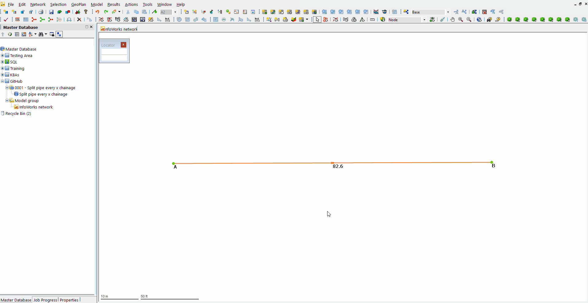

# Split a pipe every 'x' chainage
This SQL allows the user to split a single selected pipe every 'x' meters. This assumes that the pipe is projected in a straight line between the upstream and downstream node. This does not update the invert levels but that can be done with another SQL or using an inference tool. 

Any enhancements to automatically set the invert levels welcome!