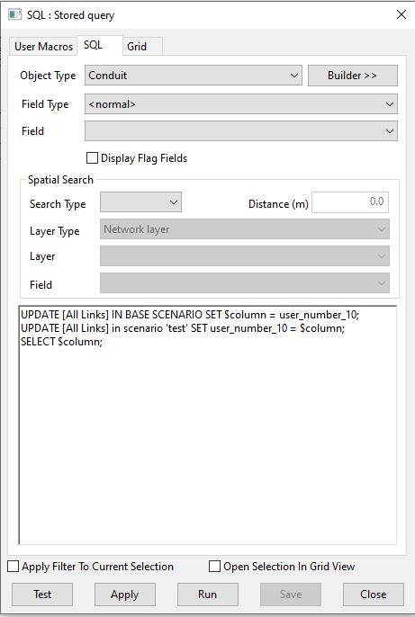

# Copy object data to a scenario
This SQL demonstrates how object data can be moved between scenarios. In this example a value from the 'Base' model is used to update the user_number_1 field for a Conduit in the 'test' scenario. This may be useful if a user has overwritten the values in a scenario but wants to return them to match the Base model.

## Animation

## SQL Dialog

