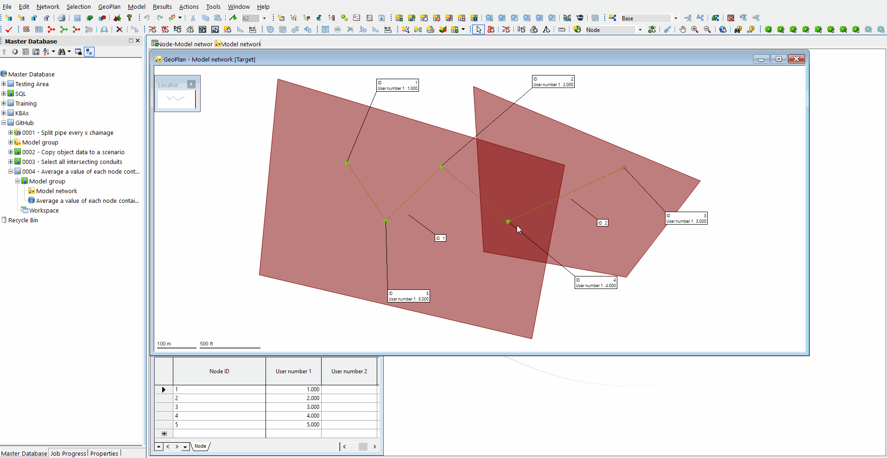
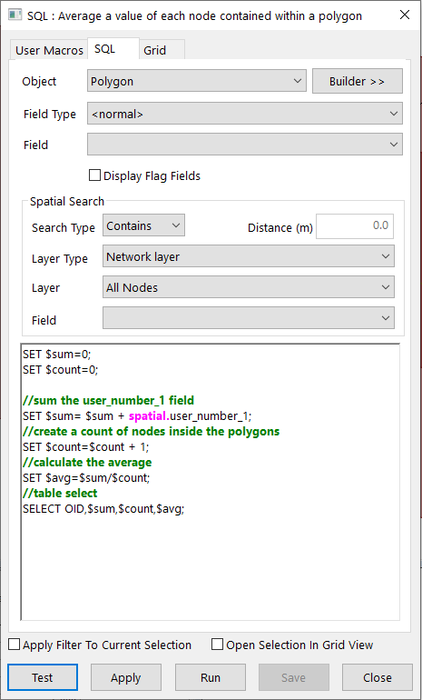

# Average a value of each node contained within a polygon
This SQL demonstrates how to create two variables and then populate these with the sum of user_number_1 values and a count of nodes which are contained within each polygon. A table is then generated for each of the polygons which contains the ID, Sum, Count and Average. Note that no values are written to any of the network objects by this SQL as it is all undertaken using variables.

## Animation

## SQL Dialog

