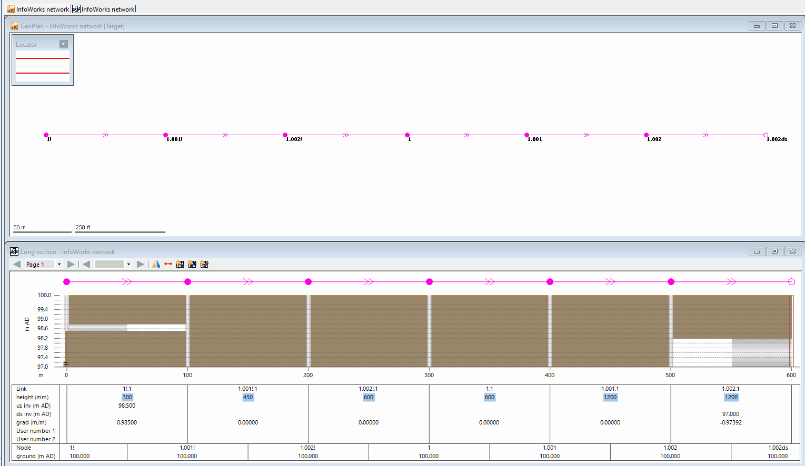

# Select all intersecting conduits
This SQL allows the user to set the ds_invert level for conduits by interpolating the soffit level. It assumes the user would make a selection of conduits with the `us_invert` and `ds_invert` set for the upper most and down most conduit respectively, with all values missing in between.

This SQL could be further enhanced to also set the us_invert level, or alternatively, the user can run the 'Conduit: Invert from soffit level' Inference. The latter option is used in the GIF.

## Animation

## SQL Dialog

