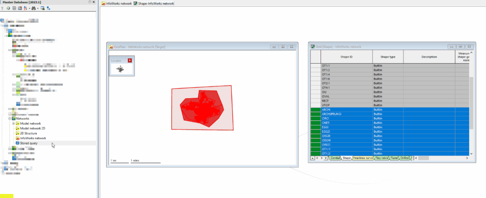
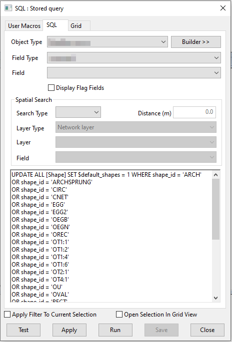

# Select all intersecting conduits
This query deletes duplicate default tables that appear when copying objects from other networks.

It currently applies to the `Shape`, `Headloss Curve` and `Sediment Grating` tables.

## Animation

## SQL Dialog

