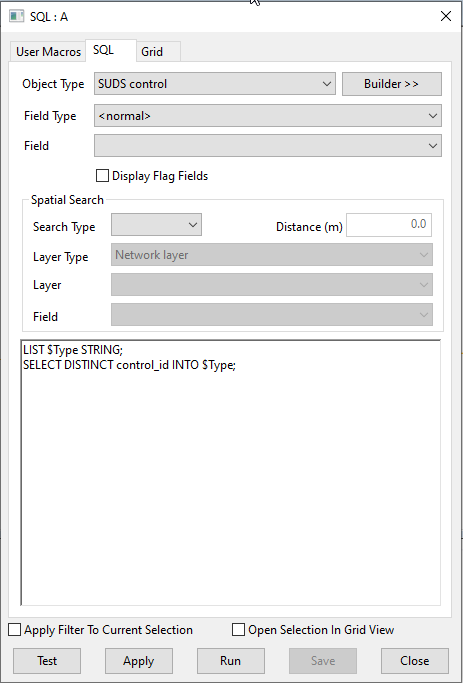
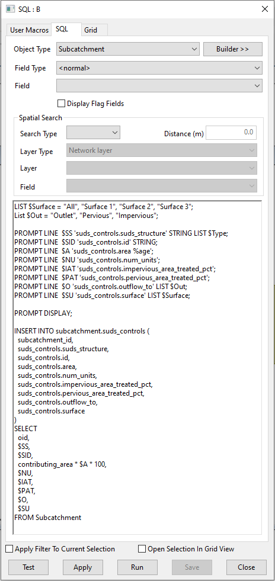

# Globally Update SuDS Controls
This SQL demonstrates how to run SQLs in groups, create a pop-up interface for the user to populate and update 'blobs' using the INSERT INTO function rather than the SET function that is used for variables. SQL A looks into the SUDS control objects and pulls out all of the DISTINCT id's into a LIST which has been created. This allows the user to avoid errors and to ensure matching IDs. SQL B generates some additional useful lists for the user and then generates the prompt box for them to populate. These values are then stored in variables but they could not be written to the SUDS Control blob using the SET function. Instead the INSERT INTO and SELECT functions are used to update the blob with the variables.

Note this SQL doesn't populate all available fields but it can easily be expanded to meet your requirements.

### SQL GROUP
It is possible to group a set of SQLs under a model group object. When the model group is dragged onto the Geoplan the SQLs will be run in alpha-numeric order. This can be particularly useful, as is the case here, when we need to access two separate object types and carry over the variables from one into the other. 

### INSERT INTO
It is possible to insert objects into the network and insert rows into blobs. To add individual objects the syntax is:
INSERT INTO<table name> (field1, field 2,... fieldn) VALUES (val1,val2,... valn)
The select statement can include WHERE and ORDER BY but not GROUP BY or HAVING and can include selection of SCENARIO, TOP and BOTTOM and SELECTED etc.

## Animation

## SQL Dialog

