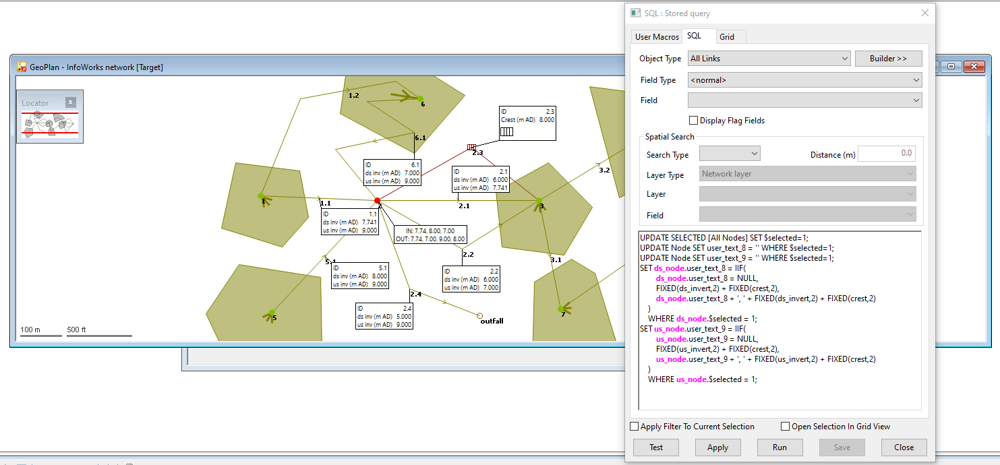

# Populate Node `user_text` fields with list of invert levels from upstream and downstream conduits
This query populates the `user_text_8` and `user_text_9` fields of selected nodes with a list of invert levels. The list is comma separated and rounded to 2 decimal cases for readability. 

It runs on links tables, such as `All Links` or `Conduit`. Conduit links have `ds_invert` and `us_invert` fields. The logic was expanded to include links such as weirs, which have a `crest` field instead. It is possible to expand this further to encompass invert fields from other link types, but that is outside the scope of this example.

## Technical note
The query works by first assigning a variable `$selected = 1` to mark all nodes which have been selected by the user. It clears the `user_text_8` and `user_text_9` fields of the selected nodes by making them `null`.

For null `user_text` fields, the `IIF` logic populates this field with the first invert level. Once the `user_text` field is not null anymore,  the `IIF` logic grabs the last known `user_text` string and concatenates with the next invert level, separated by a comma.

The expression below determines which link invert fields are populated in the node `user_text`. They are rounded to 2 decimal cases and can be expanded by adding other fields.
```
FIXED(us_invert,2) + FIXED(crest,2)
```


## SQL Dialog

