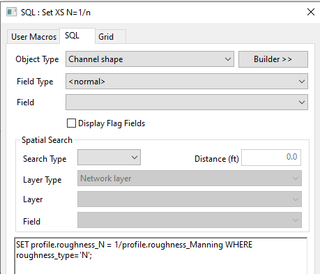

For channels, you cannot directly batch edit the cross-section profile in the grid. You can only edit one profile a time through the channel object properties window.


For batch editing, SQL let you directly access the data.

# Viewing cross-Section data

You can show all the profile data in a single table using this query.


```SQL
//object type = channel shape

SET profile.roughness_N = 1/profile.roughness_Manning WHERE roughness_type='N';
SET profile.roughness_Manning = 1/profile.roughness_N WHERE roughness_type='MANNING';
```

# Update values

Consider a scenario, you need to switch from Manning’s n to 1/n for roughness for all your cross-sections in two steps,

1.  Change the roughness type to 1/n for all cross-sections.

2.  Calculate the 1/n column from the N column.

The roughness type can be easily changed in the “Channel shape” tab.

This query can batch update the 1/n column in one step.



```SQL
//object type = channel shape
SET profile.roughness_N = 1/profile.roughness_Manning WHERE roughness_type='N';
```

# Conclusion

In summary, SQL offers a straightforward method for accessing cross-section profile data and executing batch edits.
