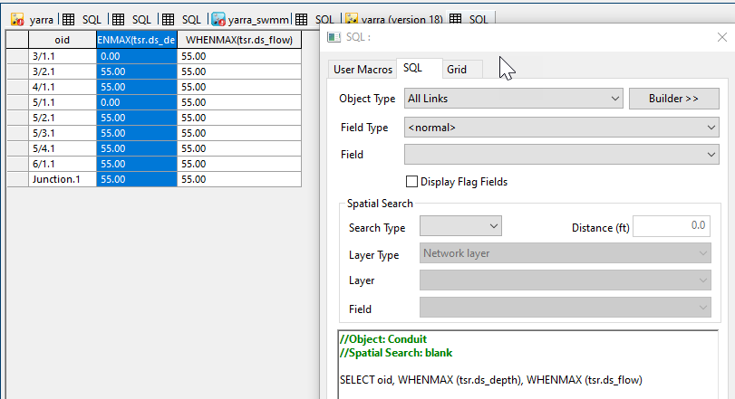

# Maximum Downstream Depth and Flow Retrieval Script for InfoWorks ICM

This SQL script retrieves the maximum downstream depth and flow for each conduit in an InfoWorks ICM model network.

## How it Works

The script operates in one main step:

1. **Retrieval of Maximum Downstream Depth and Flow**: The script selects the object ID (`oid`), maximum downstream depth (`WHENMAX (tsr.ds_depth)`), and maximum downstream flow (`WHENMAX (tsr.ds_flow)`) for each conduit in the network.

## Usage

To use this script, simply run it in the context of an open network in InfoWorks ICM. The script will automatically retrieve the maximum downstream depth and flow for each conduit in the network.

