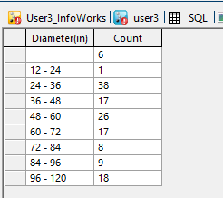

# Diameter Bucketing Script for InfoWorks ICM

These scripts group all links in an InfoWorks ICM model network by diameter and count the number of links in each diameter group. Two versions are provided — one using US Customary units (inches) and one using Metric units (millimetres).

## Scripts

| Script | Units |
|--------|-------|
| `SQL Bit Bucket for Diameter (in).sql` | US Customary (inches) |
| `SQL Bit Bucket for Diameter (mm).sql` | Metric (millimetres) |

## How it Works

1. Each script defines a list of bucket boundaries for the diameters:
   - **Inches:** 6, 8, 12, 24, 36, 48, 60, 72, 84, 96, and 120 inches
   - **Millimetres:** 100, 150, 225, 300, 375, 450, 600, 750, 900, 1200, 1500, 1800, and 2400 mm

2. It then selects all links in the network.

3. For each link, it finds the largest bucket boundary that is less than or equal to the link's diameter. This is done using the `RINDEX` function, which returns the largest value in the list that is less than or equal to the input value.

4. The script groups the links by this bucket boundary and counts the number of links in each group.

5. Finally, it selects the count of links and the bucket boundary as the diameter, and groups the results by diameter.

## Usage

Run the script in the context of an open network in InfoWorks ICM with **All Links** selected as the object type. The script will automatically group all links by diameter and count the number of links in each diameter group.

