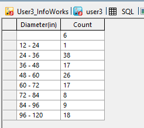

# Diameter Bucketing Script for InfoWorks ICM

This script groups all links in an InfoWorks ICM model network by diameter and counts the number of links in each diameter group.

## How it Works

1. The script first defines a list of bucket boundaries for the diameters. The boundaries are 6, 8, 12, 24, 36, 48, 60, 72, 84, 96, and 120 inches.

2. It then selects all links in the network.

3. For each link, it finds the largest bucket boundary that is less than or equal to the link's diameter. This is done using the `RINDEX` function, which returns the largest value in the list that is less than or equal to the input value.

4. The script groups the links by this bucket boundary and counts the number of links in each group.

5. Finally, it selects the count of links and the bucket boundary as the diameter, and groups the results by diameter.

## Usage

To use this script, simply run it in the context of an open network in InfoWorks ICM. The script will automatically group all links by diameter and count the number of links in each diameter group.