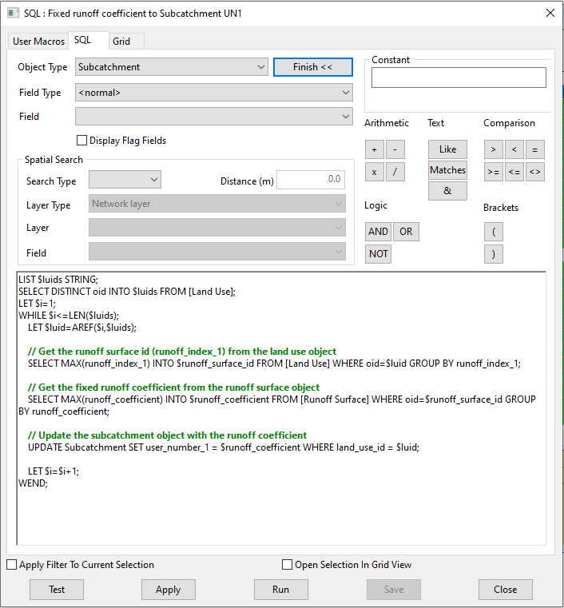

# Set Runoff Surface 'fixed runoff coefficient' in associated Subcatchment user number field
This SQL script is designed to update the user_number_1 field in the Subcatchment object with the fixed_runoff_coefficient value from the associated Runoff Surface object. Here's an overview of how it operates:

## Initialize List and Variables:

A list $luids is created to store unique Land Use object IDs.
The script selects distinct oid values (object IDs) from the Land Use table and stores them in the $luids list.
A counter variable $i is initialized to 1 to iterate through the list.

## Iterate Through Land Use IDs:

The script enters a WHILE loop that continues until all Land Use IDs in the $luids list are processed.
For each iteration, the current Land Use ID ($luid) is retrieved from the list using the AREF function.

## Retrieve Runoff Surface ID:

The script selects the runoff_index_1 (which corresponds to the runoff_surface_id) from the Land Use table for the current Land Use ID.
The runoff_surface_id is stored in the $runoff_surface_id variable.

## Retrieve Fixed Runoff Coefficient:

The script retrieves the fixed_runoff_coefficient from the Runoff Surface table using the runoff_surface_id.
This value is stored in the $runoff_coefficient variable.

## Update Subcatchment Object:

The script updates the user_number_1 field in the Subcatchment table with the fixed_runoff_coefficient value for the current Land Use ID.

This script ensures that each Subcatchment object is updated with the correct fixed_runoff_coefficient value from the associated Runoff Surface object, based on the relationships defined in the Land Use table.

# SQL Dialog
