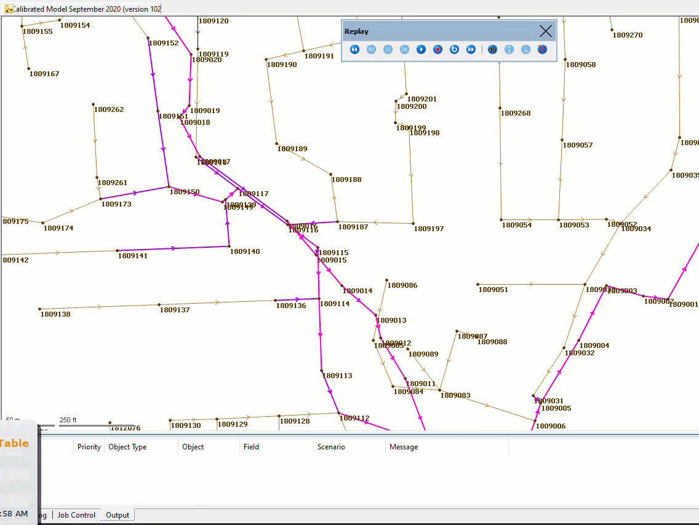

# Create custom surcharge results table
The purpose of this script is to create a custom results table for conduits based on specific surcharge and diameter criteria, as summarized here:

1. Object Type: The script focuses on conduits.
2. Simulation Results: It requires loading simulation results onto the GeoPlan before running the query.
3. Define Picklists: Two lists are defined:
- Surcharge: A list of surcharge values.
- $Dia: A list of conduit diameters in inches.
4. Prompt Setup: An interactive prompt is set up to allow the user to select a surcharge value and a diameter value from the defined lists.
5. Display SQL Table: The script then displays a SQL table with conduits meeting the selected criteria. The table includes columns for upstream node ID, downstream node ID, link suffix, conduit width, and maximum surcharge.
The goal is to enable users to interactively filter and display conduits based on the selected surcharge and diameter values.

