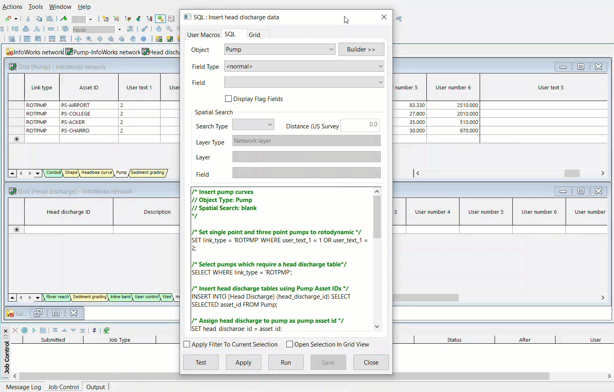

# Insert head discharge tables and curve data
The purpose of this script is to create a head discharge table for each rotodynamic pump and insert pump curve data from user number fields into each table.

