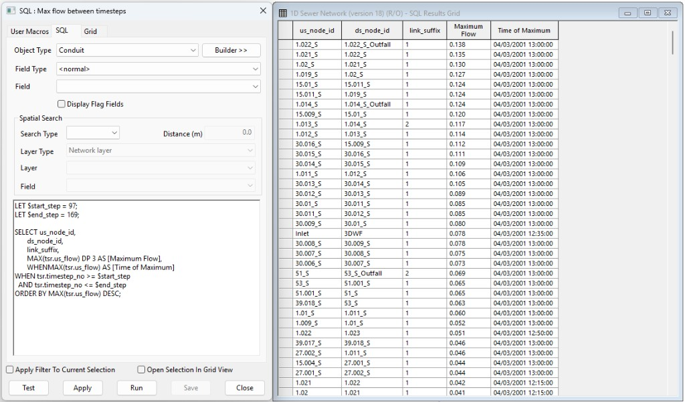

# Maximum upstream flow and time for conduits over timestep range

This SQL query reports the peak upstream flow and the time it occurred for each conduit, limited to a user-defined range of simulation timesteps.

## How it Works

1. **Timestep range**: `LET` variables `$start_step` and `$end_step` define the first and last timestep numbers to include in the analysis.
2. **Peak flow**: `MAX(tsr.us_flow)` returns the maximum upstream flow within that range, formatted to three decimal places.
3. **Time of peak**: `WHENMAX(tsr.us_flow)` returns the simulation time (or relative minutes) when that maximum occurred.
4. **Ordering**: Results are sorted by peak flow, highest first.

## Usage

1. Load simulation results onto the GeoPlan before running the query.
2. Set **Object type** to **Conduit** and leave **Spatial search** blank.
3. Adjust `$start_step` and `$end_step` to match the timestep range you want to analyse.
4. Run the query to display a results table with upstream node, downstream node, link suffix, maximum flow, and time of maximum.

