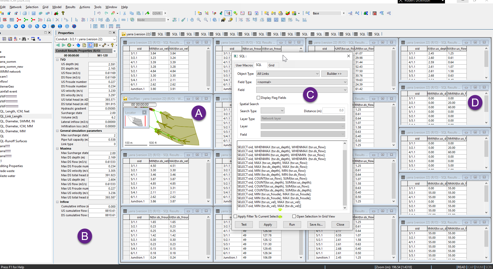

# Conduit Result Statistics for InfoWorks ICM (SWMM)

This script provides a collection of result queries for conduits in an InfoWorks ICM (SWMM) model. It extracts peak, minimum, and cumulative statistics for depth, flow, velocity, and Froude number at both the upstream and downstream ends of each conduit.

## How it Works

The script runs against conduit time-series results (`tsr`) and covers the following queries:

| Query | Description |
|-------|-------------|
| `WHENMAX(tsr.us_depth)` / `WHENMAX(tsr.us_flow)` | Time of peak upstream depth and flow |
| `WHENMAX(tsr.ds_depth)` / `WHENMAX(tsr.ds_flow)` | Time of peak downstream depth and flow |
| `WHENMIN(tsr.us_depth)` / `WHENMIN(tsr.us_flow)` | Time of minimum upstream depth and flow |
| `WHENMIN(tsr.ds_depth)` / `WHENMIN(tsr.ds_flow)` | Time of minimum downstream depth and flow |
| `MAX(tsr.us_depth)` / `MAX(tsr.us_flow)` | Peak upstream depth and flow |
| `MAX(tsr.ds_depth)` / `MAX(tsr.ds_flow)` | Peak downstream depth and flow |
| `MIN(tsr.us_depth)` / `MIN(tsr.us_flow)` | Minimum upstream depth and flow |
| `MIN(tsr.ds_depth)` / `MIN(tsr.ds_flow)` | Minimum downstream depth and flow |
| `COUNT` / `SUM(tsr.us_flow)` | Count and total upstream flow |
| `COUNT` / `SUM(tsr.us_depth)` | Count and total upstream depth |
| `COUNT` / `SUM(tsr.ds_depth)` | Count and total downstream depth |
| `MIN` / `MAX(tsr.us_froude)` | Upstream Froude number range |
| `MIN` / `MAX(tsr.ds_froude)` | Downstream Froude number range |
| `MIN` / `MAX(tsr.us_vel)` | Upstream velocity range |
| `MIN` / `MAX(tsr.ds_vel)` | Downstream velocity range |

## Usage

Run individual queries as needed against an open simulation result in InfoWorks ICM. The script is structured as separate `SELECT` statements — run each one independently depending on which statistic you need.

