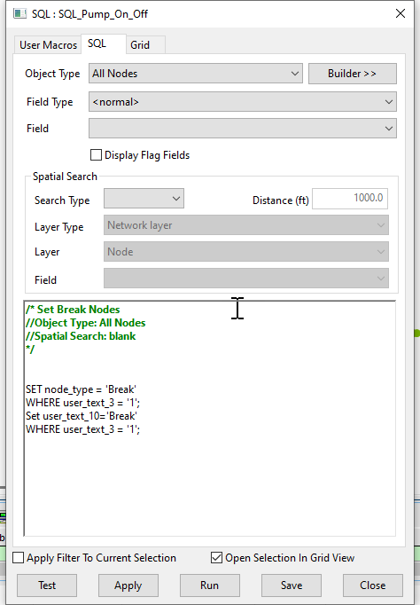

# Break Node Setting Script for InfoWorks ICM

This SQL script sets the node type to 'Break' for specific nodes in an InfoWorks ICM model network.

## How it Works

The script operates in two main steps:

1. **Setting Node Type**: The script updates the 'node_type' field to 'Break' for all nodes where 'user_text_3' equals '1'. This operation changes the node type to 'Break' for these nodes.

