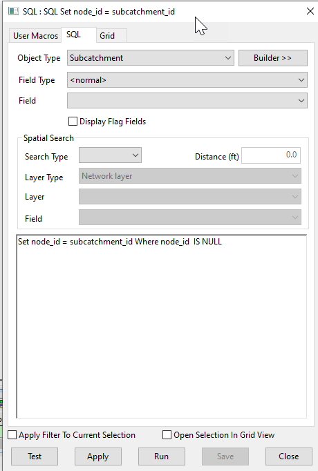

# Subcatchment Node ID Assignment Script for InfoWorks ICM

This SQL script assigns the `node_id` field for all nodes in an InfoWorks ICM model network based on the corresponding `subcatchment_id`.

## How it Works

The script operates in one main step:

1. **Node ID Assignment**: The script sets the `node_id` field to the value of `subcatchment_id` for all nodes where `node_id` is NULL. This operation assigns a `node_id` to nodes that currently do not have one, using the corresponding `subcatchment_id`.

## Usage

To use this script, simply run it in the context of an open network in InfoWorks ICM. The script will automatically assign the `node_id` based on the `subcatchment_id` for all nodes where `node_id` is NULL.

