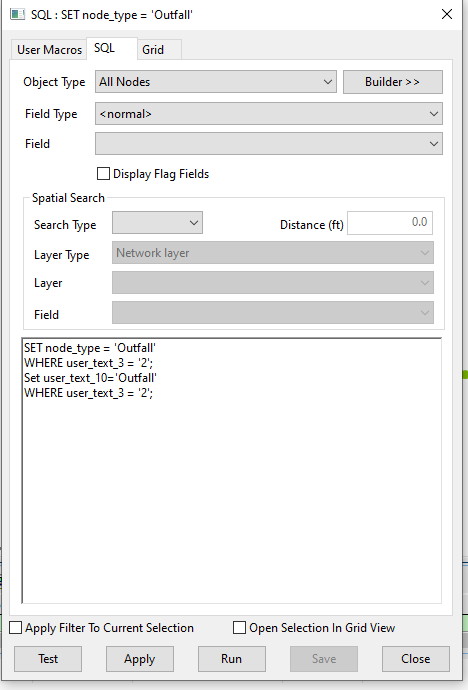

# Outfall Node Setting Script for InfoWorks ICM

This SQL script sets the node type to 'Outfall' for specific nodes in an InfoWorks ICM model network.

## How it Works

The script operates in two main steps:

1. **Setting Node Type**: The script updates the 'node_type' field to 'Outfall' for all nodes where 'user_text_3' equals '2'. This operation changes the node type to 'Outfall' for these nodes.

2. **Setting User Text**: The script updates the 'user_text_10' field to 'Outfall' for all nodes where 'user_text_3' equals '2'. This operation labels these nodes as 'Outfall' in the 'user_text_10' field.

## Usage

To use this script, simply run it in the context of an open network in InfoWorks ICM. The script will automatically set the node type to 'Outfall' and update the 'user_text_10' field for all nodes where 'user_text_3' equals '2'.

