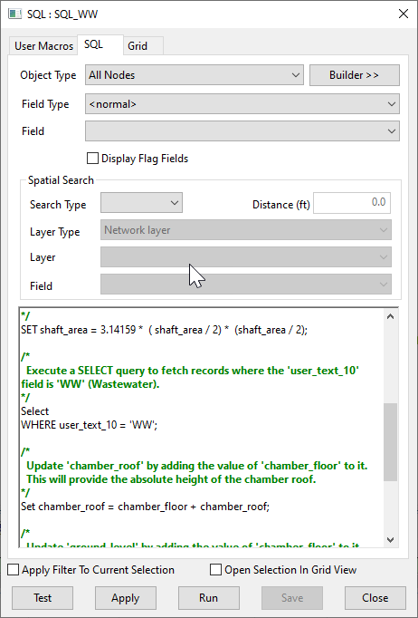

# Pump Switch Level Adjustment Script for InfoWorks ICM

This SQL script adjusts the switch on and off levels for all pumps in an InfoWorks ICM model network based on the chamber floor elevation.

## How it Works

The script operates in one main step:

1. **Switch Level Adjustment**: The script updates the 'switch_on_level' and 'switch_off_level' fields for all pumps. It adds the 'chamber_floor' value from the 'spatial' table to both switch levels. This operation adjusts the switch levels based on the elevation of the chamber floor, ensuring that the pump switches on and off at the correct water levels.

## Usage

To use this script, simply run it in the context of an open network in InfoWorks ICM. The script will automatically adjust the switch on and off levels for all pumps in the network.

