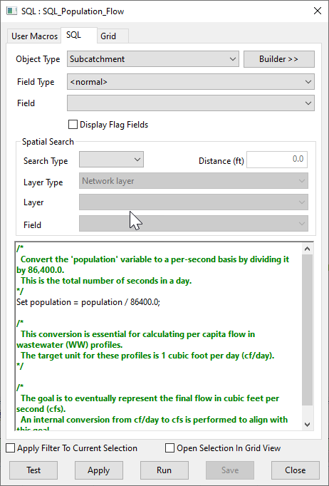

# Population Flow Adjustment Script for InfoWorks ICM

This SQL script adjusts the population flow for all nodes and subcatchments in an InfoWorks ICM model network.

## How it Works

The script operates in one main step:

1. **Population Flow Adjustment**: The script updates the 'population' field for all nodes and subcatchments. It divides the current population value by 86400.0. This operation is necessary to convert the population flow to a per capita flow in the wastewater profile, expressed in cubic feet per day.

## Usage

To use this script, simply run it in the context of an open network in InfoWorks ICM. The script will automatically adjust the population flow for all nodes and subcatchments in the network.

