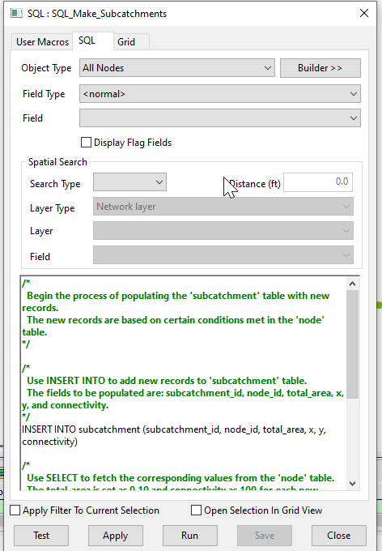

# Subcatchment Creation Script for InfoWorks ICM

This SQL script creates new subcatchments in an InfoWorks ICM model network based on existing nodes of type 'Manhole'.

## How it Works

The script operates in one main step:

1. **Subcatchment Creation**: The script inserts new records into the 'subcatchment' table. Each new record corresponds to a node of type 'Manhole' in the 'node' table. The fields populated for each new subcatchment are:
    - `subcatchment_id`: Set to the ID of the corresponding node.
    - `node_id`: Set to the ID of the corresponding node.
    - `total_area`: Set to 0.10 (presumably in square units corresponding to your model's units).
    - `x`: Set to the x-coordinate of the corresponding node.
    - `y`: Set to the y-coordinate of the corresponding node.
    - `connectivity`: Set to 100.

## Usage

To use this script, simply run it in the context of an open network in InfoWorks ICM. The script will automatically create new subcatchments for all nodes of type 'Manhole' in the network.

