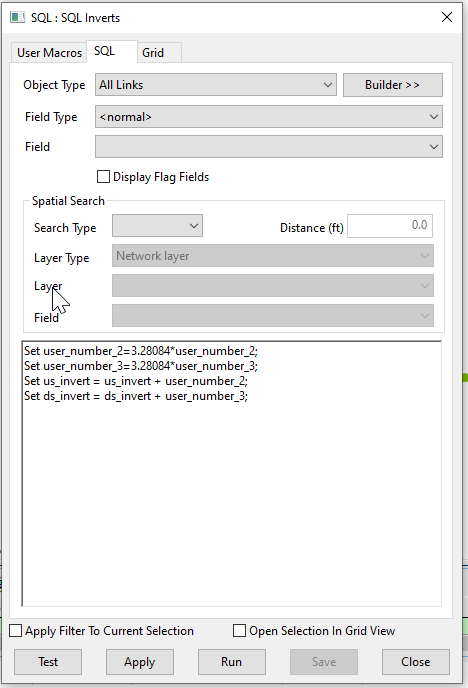

# InfoWorks Networks
These SQLs are intended to work with the ICM InfoWorks networks

# Invert Level Adjustment Script for InfoWorks ICM

This SQL script adjusts the invert levels for all links in an InfoWorks ICM model network. It specifically targets links with missing invert levels.

## How it Works

The script operates in four main steps:

1. **Conversion of User Number 2**: The script updates the 'user_number_2' field by converting its value from meters to feet. This is done by multiplying the current value by 3.28084.

2. **Conversion of User Number 3**: Similarly, the script updates the 'user_number_3' field by converting its value from meters to feet. This is done by multiplying the current value by 3.28084.

3. **Upstream Invert Adjustment**: The script updates the 'us_invert' field by adding the value of 'user_number_2'. This adjusts the upstream invert level based on the value specified in 'user_number_2'.

4. **Downstream Invert Adjustment**: The script updates the 'ds_invert' field by adding the value of 'user_number_3'. This adjusts the downstream invert level based on the value specified in 'user_number_3'.

## Usage

To use this script, simply run it in the context of an open network in InfoWorks ICM. The script will automatically adjust the invert levels for all links based on the specified conditions.

