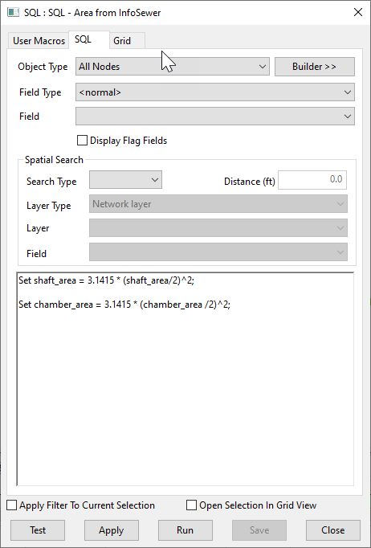

# InfoWorks Networks
These SQLs are intended to work with the ICM InfoWorks networks

# Node Area Calculation Script for InfoSewer

This SQL script calculates the shaft and chamber areas for all nodes in an InfoSewer model network.

## How it Works

The script operates in two main steps:

1. **Shaft Area Calculation**: The script updates the `shaft_area` field for all nodes. It calculates the area of a circle using the formula πr², where r is the radius of the shaft (half of the `shaft_area` value).

2. **Chamber Area Calculation**: Similarly, the script updates the `chamber_area` field for all nodes. It calculates the area of a circle using the formula πr², where r is the radius of the chamber (half of the `chamber_area` value).

## Usage

To use this script, simply run it in the context of an open network in InfoSewer. The script will automatically calculate and update the shaft and chamber areas for all nodes in the network.

