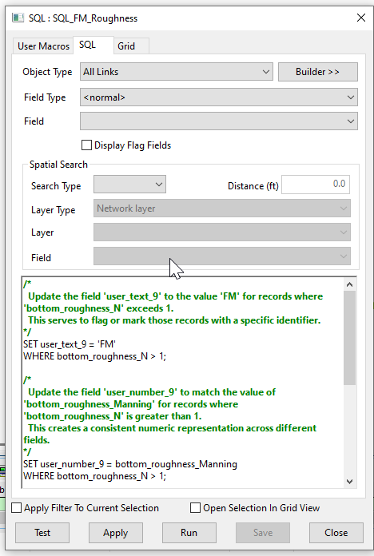

# InfoWorks Networks
These SQLs are intended to work with the InfoWorks SWMM networks

# Roughness Adjustment Script for InfoWorks ICM

This SQL script adjusts the roughness parameters for all nodes and subcatchments in an InfoWorks ICM model network. It specifically targets elements with a Manning's roughness coefficient greater than 1.

## How it Works

The script operates in three main steps:

1. **Marking High Roughness Values**: The script updates the 'user_text_9' field to 'FM' for all nodes and subcatchments where the 'bottom_roughness_N' is greater than 1. This serves as a marker for elements with unusually high roughness values.

2. **Recording Original Roughness Values**: The script updates the 'user_number_9' field to the current value of 'bottom_roughness_Manning' for all nodes and subcatchments where 'bottom_roughness_N' is greater than 1. This preserves the original roughness value before it's adjusted.

3. **Adjusting Roughness Values**: The script updates the 'bottom_roughness_N' and 'top_roughness_N' fields to 0.014 for all nodes and subcatchments where these values are greater than 1. This standardizes the roughness values to a more typical range.

## Usage

To use this script, simply run it in the context of an open network in InfoWorks ICM. The script will automatically adjust the roughness parameters for all nodes and subcatchments based on the specified conditions.

