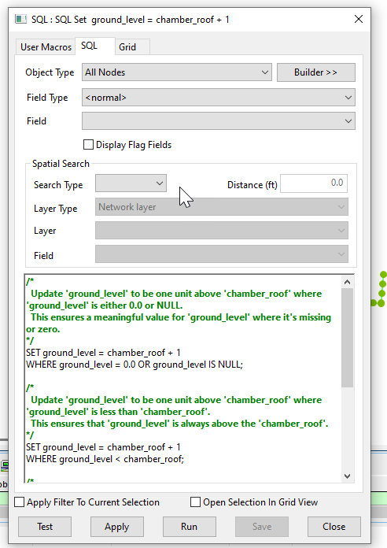

# InfoWorks SWMM Networks
These SQLs are intended to work with the InfoWorks SWMM networks

# Node Ground Level Adjustment Script for InfoWorks ICM

This SQL script adjusts the ground level, flood level, and chamber roof values for all nodes in an InfoWorks ICM model network to ensure consistency and accuracy in the model.

## How it Works

The script operates in four main steps:

1. **Ground Level Adjustment for Zero or Null Values**: The script updates the 'ground_level' field to be one unit above the 'chamber_roof' field for all nodes where 'ground_level' is either 0.0 or NULL. This ensures a meaningful value for 'ground_level' where it's missing or zero.

2. **Ground Level Adjustment for Values Below Chamber Roof**: The script updates the 'ground_level' field to be one unit above the 'chamber_roof' field for all nodes where 'ground_level' is less than 'chamber_roof'. This ensures that 'ground_level' is always above the 'chamber_roof'.

3. **Flood Level Adjustment for Values Below Chamber Roof**: The script updates the 'flood_level' field to be one unit above the 'chamber_roof' field for all nodes where 'flood_level' is less than 'chamber_roof'. This ensures that 'flood_level' is always above the 'chamber_roof'.

4. **Chamber Roof Adjustment for Values Below Chamber Floor**: The script updates the 'chamber_roof' field by adding the 'chamber_floor' field for all nodes where 'chamber_roof' is less than 'chamber_floor'. This ensures that 'chamber_roof' is always above the 'chamber_floor'.

## Usage

To use this script, simply run it in the context of an open network in InfoWorks ICM. The script will automatically adjust the ground level, flood level, and chamber roof values for all nodes based on the specified conditions.