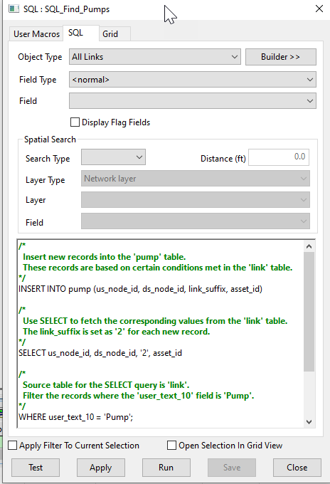

# ICM Networks
These SQLs are intended to work with the InfoWorks SWMM networks

# Pump Table Update Script for InfoWorks ICM

This SQL script updates the pump table in an InfoWorks ICM model network by inserting new records based on certain conditions met in the link table.

## How it Works

The script operates in two main steps:

1. **Insertion of New Records**: The script inserts new records into the 'pump' table. These records are based on certain conditions met in the 'link' table. The `link_suffix` is set as '2' for each new record. The source table for the SELECT query is 'link'. The script filters the records where the 'user_text_10' field is 'Pump'.

2. **Deletion of Old Records**: After the new records have been inserted into the 'pump' table, the script deletes records from the 'link' table where 'user_text_10' equals 'Pump'. This helps to avoid duplicate or unnecessary records.

## Usage

To use this script, simply run it in the context of an open network in InfoWorks ICM. The script will automatically update the pump table by inserting new records and deleting old ones based on the specified conditions.